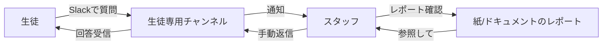
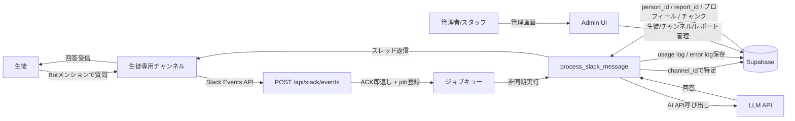

# 業務理解 — juku-ai-slack-bot

## 1. ビジネス背景

### 1.1 現状の課題

| # | 課題 | 影響を受ける人 | 頻度 | 深刻度 |
|---|------|--------------|------|--------|
| 1 | 生徒からの質問に都度スタッフが手動で回答する必要があり、スタッフの時間コストが高い | スタッフ | 毎日 | 高 |
| 2 | 生徒が授業外（夜・休日）に質問できず、学習の継続性が途切れる | 生徒 | 毎週 | 高 |
| 3 | 各生徒の学習状況をスタッフが毎回確認した上で回答する必要があり、情報の引き出しに手間がかかる | スタッフ | 毎回 | 中 |
| 4 | 生徒ごとに異なる苦手分野・学習スタイルを把握した上での個別対応が属人的になっている | スタッフ、生徒 | 毎週 | 中 |

### 1.2 現在の対処方法

- スタッフが手動でSlackに返信
- 生徒のレポートを都度確認して回答内容を調整
- 夜・休日は翌営業日まで回答待ち

---

## 2. プロジェクト目的

### 2.1 ゴール（優先順位付き）

| 優先度 | ゴール | 成功指標（KPI） |
|--------|--------|---------------|
| P0 | 生徒が24時間いつでもAIから個別化された学習回答を受けられる | Slack上でのBot回答成功率 ≥ 95% |
| P0 | 各生徒の学習レポートを参照した個別対応ができる | レポートのRAG参照率（全回答中） |
| P1 | スタッフの質問対応工数を削減する | 週次スタッフ対応件数の減少 |
| P1 | 利用状況・コストをリアルタイムに把握できる | 管理画面でのtoken/コスト可視化 |
| P2 | AI回答品質を継続的に改善できる体制を作る | エラー率・会話ログでの品質モニタリング |

### 2.2 リリース計画

- 希望時期: 未定（まったり高品質に育てる方針）
- 開発体制: 個人開発
- 予算感: 未定。インフラコストはVercel + Supabase無料〜低コスト帯を想定
- フェーズ分割: Phase 1 → Phase 2 → Phase 3 → Phase 4 の段階リリース

---

## 3. スコープ

### 3.1 In Scope（MVP）

- Slack Botのメンション受信・スレッド返信
- スレッド内follow-up（メンションなしで反応）
- チャンネルと生徒の紐付け管理
- Supabase上のレポート保存・RAG参照
- 生徒プロフィール要約（AI用）
- 画像添付対応（jpg / png / jpeg / webp、1〜3枚）
- 基本エラー分類・ログ
- usage log（トークン・コスト記録）
- 管理画面（生徒・チャンネル・レポート・エラー管理）

### 3.2 Out of Scope（MVP除外）

- 独自チャットUI（Slack以外のUI）
- PDF全文解析
- 動画・音声対応
- 画像内個人情報の自動マスキング
- OCR全文検索
- Slackメッセージ編集/削除の同期
- 複数Slackワークスペース対応
- 複雑な請求・コスト配賦
- 高度なダッシュボード・再実行UI
- 高度な権限管理（スタッフ権限の粒度制御）
- Slack Connect・外部共有チャンネル

### 3.3 将来拡張構想

- PDF全文解析・問題文抽出
- OCRテキスト保存・検索
- 複数ワークスペース対応
- AI補助によるレポート作成
- より高度な利用状況ダッシュボード
- 生徒向けポータルUI（Slack以外）
- 自動スタッフ通知（エラー・コスト超過アラート）

---

## 4. 業務フロー

### 4.1 As-Is（現状）

### 4.2 To-Be（本システム導入後）

---

## 5. 外部連携

| 連携先 | 連携方法 | 目的 | 必須/任意 |
|--------|----------|------|----------|
| Slack | Events API (Webhook受信) + Web API (メッセージ投稿・ファイル取得) | Bot機能のコア | 必須 |
| LLM API (Claude / OpenAI等) | REST API | テキスト回答・Vision回答・embedding生成 | 必須 |
| Supabase | PostgreSQL + pgvector + Storage + Auth | DB・ファイル保存・認証 | 必須 |
| Vercel | デプロイプラットフォーム | APIホスティング + 管理画面ホスティング | 必須 [仮決定] |
| 非同期ジョブ基盤 (Supabase job table / Inngest / QStash) | HTTP or ポーリング | Slack ACKとAI処理の分離 | 必須 [仮決定] |
