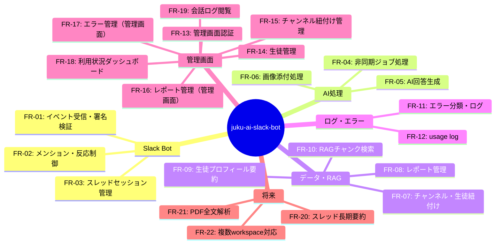

# スコープ・機能一覧 — juku-ai-slack-bot

## 1. 機能概要マップ

---

## 2. カテゴリ別一覧

### 2.1 Slack Bot コア

| 機能ID | 機能名 | 優先度 | 対象ユーザー | 詳細ファイル |
|--------|--------|--------|------------|------------|
| FR-01 | Slackイベント受信・署名検証 | P0 | システム（内部） | features/FR-01_slack-event-receiver.md |
| FR-02 | メンション・反応制御 | P0 | U-01, U-02 | features/FR-02_mention-reaction-control.md |
| FR-03 | スレッドセッション管理 | P0 | U-01, U-02 | features/FR-03_thread-session.md |

### 2.2 AI処理

| 機能ID | 機能名 | 優先度 | 対象ユーザー | 詳細ファイル |
|--------|--------|--------|------------|------------|
| FR-04 | 非同期ジョブ処理 | P0 | システム（内部） | features/FR-04_async-job.md |
| FR-05 | AI回答生成 | P0 | U-01, U-02 | features/FR-05_ai-answer.md |
| FR-06 | 画像添付処理 | P0 | U-01, U-02 | features/FR-06_image-attachment.md |

### 2.3 データ・RAG

| 機能ID | 機能名 | 優先度 | 対象ユーザー | 詳細ファイル |
|--------|--------|--------|------------|------------|
| FR-07 | チャンネル・生徒紐付け | P0 | U-03 | features/FR-07_channel-binding.md |
| FR-08 | レポート管理（データ層） | P0 | U-02, U-03 | features/FR-08_report-management.md |
| FR-09 | 生徒プロフィール要約 | P0 | U-02, U-03 | features/FR-09_student-profile.md |
| FR-10 | RAGチャンク検索 | P0 | システム（内部） | features/FR-10_rag-chunk-search.md |

### 2.4 ログ・エラー

| 機能ID | 機能名 | 優先度 | 対象ユーザー | 詳細ファイル |
|--------|--------|--------|------------|------------|
| FR-11 | エラー分類・ログ | P0 | システム（内部） | features/FR-11_error-logging.md |
| FR-12 | usage log | P0 | システム（内部） | features/FR-12_usage-log.md |

### 2.5 管理画面

| 機能ID | 機能名 | 優先度 | 対象ユーザー | 詳細ファイル |
|--------|--------|--------|------------|------------|
| FR-13 | 管理画面認証 | P0 | U-02, U-03 | features/FR-13_admin-auth.md |
| FR-14 | 生徒管理（管理画面） | P0 | U-02, U-03 | features/FR-14_admin-persons.md |
| FR-15 | チャンネル紐付け管理（管理画面） | P0 | U-03 | features/FR-15_admin-channel-bindings.md |
| FR-16 | レポート管理（管理画面） | P0 | U-02, U-03 | features/FR-16_admin-reports.md |
| FR-17 | エラー管理（管理画面） | P0 | U-02, U-03 | features/FR-17_admin-errors.md |
| FR-18 | 利用状況ダッシュボード | P1 | U-02, U-03 | features/FR-18_admin-dashboard.md |
| FR-19 | 会話ログ閲覧 | P1 | U-02, U-03 | features/FR-19_admin-conversation-log.md |

### 2.6 将来対応

| 機能ID | 機能名 | 優先度 | 詳細ファイル |
|--------|--------|--------|------------|
| FR-20 | スレッド長期要約 | P1 | features/FR-20_thread-summary.md |
| FR-21 | PDF全文解析 | P2 | features/FR-21_pdf-analysis.md |
| FR-22 | 複数workspace対応 | P3 | features/FR-22_multi-workspace.md |

---

## 3. 優先度サマリー

| 優先度 | 件数 | 主要機能 |
|--------|------|---------|
| P0 (MUST / MVP必須) | 17件 | FR-01〜FR-17 |
| P1 (SHOULD / 初期リリース後) | 3件 | FR-18, FR-19, FR-20 |
| P2 (COULD / 余裕があれば) | 1件 | FR-21 |
| P3 (FUTURE / 将来拡張) | 1件 | FR-22 |
