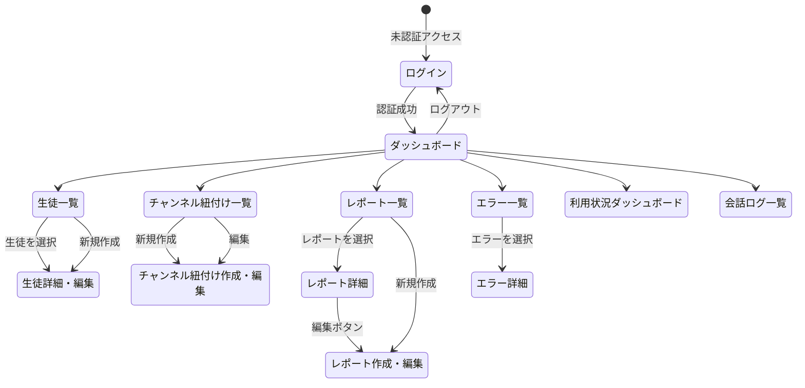
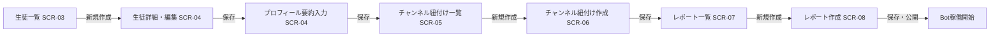
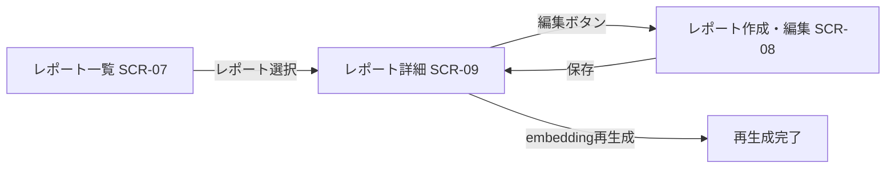

# 画面遷移図 — juku-ai-slack-bot

> 注意: 主UIはSlack。以下の画面はすべて管理画面（Webブラウザ）のもの。

## 1. 画面一覧

| 画面ID | 画面名 | URL案 | 概要 | 対象ユーザー | 認証要否 |
|--------|--------|-------|------|------------|---------|
| SCR-01 | ログイン | /login | 管理画面へのログイン | U-02, U-03 | 不要 |
| SCR-02 | ダッシュボード | /dashboard | 管理画面TOP。簡易サマリー表示 | U-02, U-03 | 必要 |
| SCR-03 | 生徒一覧 | /persons | 全生徒の一覧 | U-02, U-03 | 必要 |
| SCR-04 | 生徒詳細・編集 | /persons/:id | 生徒情報・プロフィール要約・利用状況 | U-02, U-03 | 必要 |
| SCR-05 | チャンネル紐付け一覧 | /bindings | チャンネルと生徒の対応一覧 | U-03 | 必要 |
| SCR-06 | チャンネル紐付け作成・編集 | /bindings/new, /bindings/:id | 紐付けの作成・編集 | U-03 | 必要 |
| SCR-07 | レポート一覧 | /reports | 全レポートの一覧（生徒別・月別フィルタ） | U-02, U-03 | 必要 |
| SCR-08 | レポート作成・編集 | /reports/new, /reports/:id/edit | Markdownエディタでレポート編集 | U-02, U-03 | 必要 |
| SCR-09 | レポート詳細 | /reports/:id | レポート内容・AI設定・embedding操作 | U-02, U-03 | 必要 |
| SCR-10 | 利用状況ダッシュボード | /dashboard/usage | トークン・コスト・質問数の可視化（P1） | U-02, U-03 | 必要 |
| SCR-11 | エラー一覧 | /errors | エラーログ一覧 | U-02, U-03 | 必要 |
| SCR-12 | エラー詳細 | /errors/:id | エラー詳細・対応済みマーク・メモ | U-02, U-03 | 必要 |
| SCR-13 | 会話ログ一覧 | /logs | スレッド単位の会話一覧（P1） | U-02, U-03 | 必要 |

---

## 2. 全体遷移図



---

## 3. 認証フロー

```mermaid
flowchart TD
    A[任意のページにアクセス] --> B{認証済み?}
    B -->|Yes| C[そのページを表示]
    B -->|No| D[/loginにリダイレクト]
    D --> E[メール+パスワード入力]
    E --> F{認証成功?}
    F -->|Yes| G[/dashboardにリダイレクト]
    F -->|No| H[エラーメッセージ表示]
    H --> E
```

---

## 4. 主要業務フロー（管理画面側）

### 新規生徒の設定フロー



### レポート更新フロー



---

## 5. 各画面の概要

### SCR-01: ログイン
- URL: `/login`
- 主要要素: メールアドレス入力、パスワード入力、ログインボタン
- 遷移先: ダッシュボード（SCR-02）
- 関連機能: FR-13

### SCR-02: ダッシュボード
- URL: `/dashboard`
- 主要要素: 簡易サマリー（本日の質問数・エラー数・最新利用生徒）、ナビゲーション
- 遷移先: 各管理ページ
- 関連機能: FR-13, FR-18（P1）

### SCR-03: 生徒一覧
- URL: `/persons`
- 主要要素: 生徒一覧テーブル（名前・学年・ステータス・最終利用日・累計質問数）、新規作成ボタン
- 遷移先: SCR-04（詳細）
- 関連機能: FR-14

### SCR-04: 生徒詳細・編集
- URL: `/persons/:id`
- 主要要素: 生徒基本情報フォーム、プロフィール要約入力、利用状況サマリー、紐付きチャンネル一覧
- 遷移先: SCR-05, SCR-07
- 関連機能: FR-14, FR-09

### SCR-05: チャンネル紐付け一覧
- URL: `/bindings`
- 主要要素: 紐付け一覧テーブル（チャンネルID・チャンネル名・生徒名・ステータス・最終イベント日時）、新規作成ボタン
- 遷移先: SCR-06
- 関連機能: FR-15

### SCR-06: チャンネル紐付け作成・編集
- URL: `/bindings/new`, `/bindings/:id`
- 主要要素: チャンネルID入力、チャンネル名入力（表示用）、生徒選択、デフォルトレポート選択、ステータス切り替え
- 遷移先: SCR-05（保存後）
- 関連機能: FR-15, FR-07

### SCR-07: レポート一覧
- URL: `/reports`
- 主要要素: レポート一覧テーブル（生徒名・対象月・ステータス・AI参照設定・最終更新日）、生徒別フィルタ、新規作成ボタン
- 遷移先: SCR-09（詳細）、SCR-08（新規作成）
- 関連機能: FR-16, FR-08

### SCR-08: レポート作成・編集
- URL: `/reports/new`, `/reports/:id/edit`
- 主要要素: タイトル・対象月入力、Markdownエディタ、ステータス選択、AI参照フラグ
- 遷移先: SCR-09（保存後）
- 関連機能: FR-16, FR-08

### SCR-09: レポート詳細
- URL: `/reports/:id`
- 主要要素: レポート内容（Markdownレンダリング）、ステータス・AI参照設定、Embedding再生成ボタン、Embedding古さ警告
- 遷移先: SCR-08（編集）
- 関連機能: FR-16, FR-10

### SCR-10: 利用状況ダッシュボード（P1）
- URL: `/dashboard/usage`
- 主要要素: 期間フィルタ、日別質問数グラフ、トークン/コスト集計、モデル別内訳
- 関連機能: FR-18

### SCR-11: エラー一覧
- URL: `/errors`
- 主要要素: エラー一覧テーブル（エラーコード・severity・日時・生徒名・対応済みフラグ）、フィルタ
- 遷移先: SCR-12（詳細）
- 関連機能: FR-17

### SCR-12: エラー詳細
- URL: `/errors/:id`
- 主要要素: エラー詳細情報、ユーザーへの返信文言、対応済みボタン、メモ欄
- 遷移先: SCR-11（一覧に戻る）
- 関連機能: FR-17

### SCR-13: 会話ログ一覧（P1）
- URL: `/logs`
- 主要要素: スレッド一覧（生徒名・チャンネル名・日時・質問数・token数・エラー有無）、フィルタ
- 関連機能: FR-19
