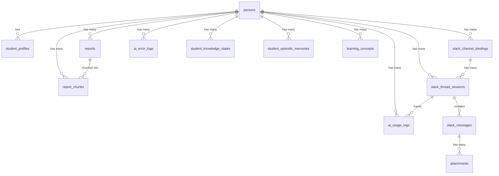

# DB 設計 — juku-ai-slack-bot

## 1. 設計方針

- 命名規則: snake_case、テーブル名は複数形
- 主キー: UUID (`gen_random_uuid()`)
- 共通カラム: `created_at TIMESTAMPTZ DEFAULT now()`、更新系テーブルに `updated_at`
- タイムスタンプ: UTC 保存
- 論理削除: 基本的に採用しない（Slackメッセージログは物理削除もしない）
- pgvector: `report_chunks.embedding` に使用（次元数: 1536 [仮決定: OpenAI text-embedding-ada-002 想定]）
- RLS: 全テーブルに有効化。管理画面APIはService Roleを使用

---

## 2. ER 図

---

## 3. テーブル定義

### 3.1 TBL-persons
**関連機能**: FR-07, FR-14

| カラム名 | 型 | NULL | デフォルト | 説明 |
|---------|-----|------|-----------|------|
| id | UUID | NO | gen_random_uuid() | 主キー |
| name | VARCHAR(100) | NO | - | フルネーム |
| display_name | VARCHAR(100) | YES | NULL | Slack上の呼び名 |
| grade | VARCHAR(50) | YES | NULL | 学年（自由記述） |
| status | VARCHAR(20) | NO | 'active' | 'active' / 'inactive' |
| guardian_email | VARCHAR(255) | YES | NULL | 保護者メールアドレス。登録時に月次レポート通知を送信（DEC-16） |
| created_at | TIMESTAMPTZ | NO | now() | - |
| updated_at | TIMESTAMPTZ | NO | now() | - |

**インデックス**:
- `idx_persons_status` ON (status)

**制約**:
- CHECK (status IN ('active', 'inactive'))

---

### 3.2 TBL-student_profiles
**関連機能**: FR-09

| カラム名 | 型 | NULL | デフォルト | 説明 |
|---------|-----|------|-----------|------|
| id | UUID | NO | gen_random_uuid() | 主キー |
| person_id | UUID | NO | - | FK → persons.id、UNIQUE |
| summary | TEXT | YES | NULL | 全体要約（AI用、500〜1500 tokens目安） |
| learning_style | TEXT | YES | NULL | 説明トーン・学習スタイル |
| strengths | TEXT | YES | NULL | 得意分野 |
| weaknesses | TEXT | YES | NULL | 苦手分野 |
| instruction_notes | TEXT | YES | NULL | 指導上の注意点 |
| exam_mode_until | TIMESTAMPTZ | YES | NULL | 試験期間終了日時。この日時を超えると自動で通常モードに戻る（DEC-16） |
| exam_subjects | TEXT[] | YES | NULL | 試験対象科目リスト（例: ["数学","英語"]） |
| updated_at | TIMESTAMPTZ | NO | now() | - |

**インデックス**:
- `idx_student_profiles_person_id` ON (person_id) UNIQUE

**制約**:
- FOREIGN KEY (person_id) REFERENCES persons(id)

---

### 3.3 TBL-reports
**関連機能**: FR-08, FR-16

| カラム名 | 型 | NULL | デフォルト | 説明 |
|---------|-----|------|-----------|------|
| id | UUID | NO | gen_random_uuid() | 主キー |
| person_id | UUID | NO | - | FK → persons.id |
| title | VARCHAR(200) | NO | - | 例: 「2026年5月 月次レポート」 |
| report_month | DATE | NO | - | 月初（YYYY-MM-01） |
| body_markdown | TEXT | YES | NULL | レポート本文（AI生成中はNULL） |
| status | VARCHAR(20) | NO | 'ai_draft' | 'ai_draft' / 'draft' / 'approved' / 'sent' |
| is_ai_reference | BOOLEAN | NO | true | AI参照対象フラグ |
| generated_by_ai | BOOLEAN | NO | false | AI自動生成フラグ（DEC-16） |
| slack_message_ts | VARCHAR(50) | YES | NULL | Slack送信済みメッセージのts（DEC-16） |
| embeddings_updated_at | TIMESTAMPTZ | YES | NULL | 最後にembedding再生成した日時 |
| error_message | TEXT | YES | NULL | AI生成失敗時のエラー内容 |
| created_by | UUID | YES | NULL | 作成者ユーザーID（Supabase Auth）。AI生成時はNULL |
| created_at | TIMESTAMPTZ | NO | now() | - |
| updated_at | TIMESTAMPTZ | NO | now() | - |

**インデックス**:
- `idx_reports_person_id` ON (person_id)
- `idx_reports_person_month` ON (person_id, report_month) UNIQUE
- `idx_reports_status` ON (status) — 承認待ち一覧の高速取得用

**制約**:
- CHECK (status IN ('ai_draft', 'draft', 'approved', 'sent'))
- UNIQUE (person_id, report_month) — 同月重複防止
- FOREIGN KEY (person_id) REFERENCES persons(id)

---

### 3.4 TBL-report_chunks
**関連機能**: FR-10

> pgvector拡張が必要: `CREATE EXTENSION IF NOT EXISTS vector;`

| カラム名 | 型 | NULL | デフォルト | 説明 |
|---------|-----|------|-----------|------|
| id | UUID | NO | gen_random_uuid() | 主キー |
| report_id | UUID | NO | - | FK → reports.id |
| person_id | UUID | NO | - | 検索フィルタ用（非正規化） |
| chunk_index | INTEGER | NO | - | チャンク順序 |
| content | TEXT | NO | - | チャンク本文 |
| embedding | vector(1536) | YES | NULL | ベクトル表現（[仮決定] 1536次元） |
| metadata | JSONB | YES | NULL | section名・ページ情報等 |
| created_at | TIMESTAMPTZ | NO | now() | - |

**インデックス**:
- `idx_report_chunks_person_id` ON (person_id)
- `idx_report_chunks_report_id` ON (report_id)
- `idx_report_chunks_embedding` USING ivfflat (embedding vector_cosine_ops) WITH (lists = 100) [仮決定]

**制約**:
- FOREIGN KEY (report_id) REFERENCES reports(id) ON DELETE CASCADE
- FOREIGN KEY (person_id) REFERENCES persons(id)

---

### 3.5 TBL-slack_channel_bindings
**関連機能**: FR-07, FR-15

| カラム名 | 型 | NULL | デフォルト | 説明 |
|---------|-----|------|-----------|------|
| id | UUID | NO | gen_random_uuid() | 主キー |
| slack_team_id | VARCHAR(50) | NO | - | SlackワークスペースID |
| slack_channel_id | VARCHAR(50) | NO | - | チャンネルID（真の主キー）、UNIQUE |
| slack_channel_name | VARCHAR(200) | YES | NULL | 表示用のみ |
| person_id | UUID | NO | - | FK → persons.id |
| person_name_snapshot | VARCHAR(100) | YES | NULL | 生徒名のスナップショット（表示用） |
| default_report_id | UUID | YES | NULL | FK → reports.id |
| status | VARCHAR(20) | NO | 'active' | 'active' / 'inactive' |
| created_at | TIMESTAMPTZ | NO | now() | - |
| updated_at | TIMESTAMPTZ | NO | now() | - |

**インデックス**:
- `idx_channel_bindings_channel_id` ON (slack_channel_id) UNIQUE
- `idx_channel_bindings_person_id` ON (person_id)
- `idx_channel_bindings_status` ON (status)

**制約**:
- UNIQUE (slack_channel_id)
- CHECK (status IN ('active', 'inactive'))
- FOREIGN KEY (person_id) REFERENCES persons(id)
- FOREIGN KEY (default_report_id) REFERENCES reports(id) ON DELETE SET NULL

---

### 3.6 TBL-slack_thread_sessions
**関連機能**: FR-03

| カラム名 | 型 | NULL | デフォルト | 説明 |
|---------|-----|------|-----------|------|
| id | UUID | NO | gen_random_uuid() | 主キー |
| slack_team_id | VARCHAR(50) | NO | - | - |
| slack_channel_id | VARCHAR(50) | NO | - | - |
| root_message_ts | VARCHAR(50) | NO | - | スレッド開始メッセージのts |
| thread_ts | VARCHAR(50) | NO | - | スレッド識別子（通常root_message_tsと同一） |
| person_id | UUID | NO | - | FK → persons.id |
| report_id | UUID | YES | NULL | FK → reports.id |
| status | VARCHAR(20) | NO | 'active' | 'active' / 'closed' |
| thread_summary | TEXT | YES | NULL | 長スレッド圧縮要約（FR-20用） |
| created_at | TIMESTAMPTZ | NO | now() | - |
| updated_at | TIMESTAMPTZ | NO | now() | - |
| last_message_at | TIMESTAMPTZ | YES | NULL | 最終メッセージ日時 |

**インデックス**:
- `idx_thread_sessions_channel_thread` ON (slack_channel_id, thread_ts) UNIQUE
- `idx_thread_sessions_person_id` ON (person_id)

**制約**:
- UNIQUE (slack_channel_id, thread_ts)
- CHECK (status IN ('active', 'closed'))
- FOREIGN KEY (person_id) REFERENCES persons(id)
- FOREIGN KEY (report_id) REFERENCES reports(id) ON DELETE SET NULL

---

### 3.7 TBL-slack_messages
**関連機能**: FR-03

| カラム名 | 型 | NULL | デフォルト | 説明 |
|---------|-----|------|-----------|------|
| id | UUID | NO | gen_random_uuid() | 主キー |
| slack_team_id | VARCHAR(50) | NO | - | - |
| slack_channel_id | VARCHAR(50) | NO | - | - |
| thread_ts | VARCHAR(50) | NO | - | スレッド識別子 |
| message_ts | VARCHAR(50) | NO | - | メッセージ固有ts、UNIQUE per channel |
| slack_user_id | VARCHAR(50) | YES | NULL | 送信ユーザーのSlack ID |
| person_id | UUID | YES | NULL | FK → persons.id（Bot送信の場合NULL） |
| role | VARCHAR(20) | NO | - | 'user' / 'assistant' |
| text | TEXT | YES | NULL | メッセージ本文 |
| has_attachments | BOOLEAN | NO | false | - |
| raw_event | JSONB | YES | NULL | Slackイベントの生データ |
| created_at | TIMESTAMPTZ | NO | now() | - |

**インデックス**:
- `idx_slack_messages_thread` ON (slack_channel_id, thread_ts)
- `idx_slack_messages_person_id` ON (person_id)

---

### 3.8 TBL-attachments
**関連機能**: FR-06

| カラム名 | 型 | NULL | デフォルト | 説明 |
|---------|-----|------|-----------|------|
| id | UUID | NO | gen_random_uuid() | 主キー |
| slack_file_id | VARCHAR(50) | NO | - | SlackファイルID |
| slack_channel_id | VARCHAR(50) | NO | - | - |
| thread_ts | VARCHAR(50) | NO | - | - |
| message_ts | VARCHAR(50) | NO | - | - |
| person_id | UUID | YES | NULL | FK → persons.id |
| file_type | VARCHAR(20) | NO | - | 'jpg' / 'png' / 'webp' |
| mime_type | VARCHAR(100) | YES | NULL | - |
| original_name | VARCHAR(255) | YES | NULL | - |
| storage_path | VARCHAR(500) | YES | NULL | Supabase Storageパス |
| file_size | INTEGER | YES | NULL | バイト数 |
| width | INTEGER | YES | NULL | 画像幅 |
| height | INTEGER | YES | NULL | 画像高さ |
| ocr_text | TEXT | YES | NULL | OCRテキスト（将来用、MVP: NULL） |
| status | VARCHAR(20) | NO | 'stored' | 'storing' / 'stored' / 'failed' |
| created_at | TIMESTAMPTZ | NO | now() | - |

**インデックス**:
- `idx_attachments_thread` ON (slack_channel_id, thread_ts)

---

### 3.9 TBL-ai_usage_logs
**関連機能**: FR-12

| カラム名 | 型 | NULL | デフォルト | 説明 |
|---------|-----|------|-----------|------|
| id | UUID | NO | gen_random_uuid() | 主キー |
| person_id | UUID | NO | - | FK → persons.id |
| slack_channel_id | VARCHAR(50) | NO | - | - |
| thread_ts | VARCHAR(50) | NO | - | - |
| message_ts | VARCHAR(50) | NO | - | - |
| model | VARCHAR(100) | NO | - | 使用モデル名 |
| input_tokens | INTEGER | NO | 0 | - |
| output_tokens | INTEGER | NO | 0 | - |
| total_tokens | INTEGER | NO | 0 | - |
| estimated_cost | NUMERIC(12, 8) | NO | 0 | USD |
| has_image | BOOLEAN | NO | false | - |
| latency_ms | INTEGER | YES | NULL | AI APIレイテンシ |
| created_at | TIMESTAMPTZ | NO | now() | - |

**インデックス**:
- `idx_usage_logs_person_id` ON (person_id)
- `idx_usage_logs_created_at` ON (created_at)
- `idx_usage_logs_model` ON (model)

---

### 3.10 TBL-ai_error_logs
**関連機能**: FR-11, FR-17

| カラム名 | 型 | NULL | デフォルト | 説明 |
|---------|-----|------|-----------|------|
| id | UUID | NO | gen_random_uuid() | 主キー |
| error_code | VARCHAR(50) | NO | - | エラーコード（FR-11参照） |
| severity | VARCHAR(20) | NO | - | 'error' / 'warning' / 'info' |
| provider | VARCHAR(50) | YES | NULL | 'slack' / 'openai' / 'anthropic' / 'system' |
| person_id | UUID | YES | NULL | FK → persons.id |
| slack_channel_id | VARCHAR(50) | YES | NULL | - |
| thread_ts | VARCHAR(50) | YES | NULL | - |
| message_ts | VARCHAR(50) | YES | NULL | - |
| user_facing_message | TEXT | YES | NULL | ユーザーに返した文言 |
| internal_message | TEXT | YES | NULL | 内部エラー詳細 |
| raw_error | JSONB | YES | NULL | 生エラーデータ（表示時マスキング） |
| retryable | BOOLEAN | NO | false | - |
| resolved | BOOLEAN | NO | false | 対応済みフラグ |
| notes | TEXT | YES | NULL | 管理者メモ |
| created_at | TIMESTAMPTZ | NO | now() | - |
| updated_at | TIMESTAMPTZ | NO | now() | - |

**インデックス**:
- `idx_error_logs_created_at` ON (created_at DESC)
- `idx_error_logs_error_code` ON (error_code)
- `idx_error_logs_resolved` ON (resolved)
- `idx_error_logs_person_id` ON (person_id)

---

### 3.11 TBL-slack_event_receipts
**関連機能**: FR-01

| カラム名 | 型 | NULL | デフォルト | 説明 |
|---------|-----|------|-----------|------|
| id | UUID | NO | gen_random_uuid() | 主キー |
| event_id | VARCHAR(100) | NO | - | SlackイベントID、UNIQUE |
| slack_team_id | VARCHAR(50) | NO | - | - |
| event_type | VARCHAR(50) | NO | - | イベント種別 |
| event_ts | VARCHAR(50) | YES | NULL | - |
| received_at | TIMESTAMPTZ | NO | now() | 受信日時 |
| processed_at | TIMESTAMPTZ | YES | NULL | 処理完了日時 |
| status | VARCHAR(20) | NO | 'received' | 'received' / 'processed' / 'skipped' |

**インデックス**:
- `idx_event_receipts_event_id` ON (event_id) UNIQUE
- `idx_event_receipts_received_at` ON (received_at)

> 古いレコードは定期削除可能（30日以上前）。冪等性確保が目的のため長期保存不要。

---

### 3.12 TBL-jobs
**関連機能**: FR-04

| カラム名 | 型 | NULL | デフォルト | 説明 |
|---------|-----|------|-----------|------|
| id | UUID | NO | gen_random_uuid() | 主キー |
| job_type | VARCHAR(50) | NO | - | 'process_slack_message' |
| status | VARCHAR(20) | NO | 'pending' | 'pending' / 'processing' / 'completed' / 'failed' |
| payload | JSONB | NO | - | ジョブ実行に必要なデータ |
| attempt_count | INTEGER | NO | 0 | - |
| max_attempts | INTEGER | NO | 3 | - |
| scheduled_at | TIMESTAMPTZ | NO | now() | - |
| started_at | TIMESTAMPTZ | YES | NULL | - |
| finished_at | TIMESTAMPTZ | YES | NULL | - |
| error_code | VARCHAR(50) | YES | NULL | 失敗時のエラーコード |
| created_at | TIMESTAMPTZ | NO | now() | - |
| updated_at | TIMESTAMPTZ | NO | now() | - |

**インデックス**:
- `idx_jobs_status_scheduled` ON (status, scheduled_at) WHERE status = 'pending'
- `idx_jobs_created_at` ON (created_at)

---

---

### 3.13 TBL-student_knowledge_states
**関連機能**: FR-23

| カラム名 | 型 | NULL | デフォルト | 説明 |
|---------|-----|------|-----------|------|
| id | UUID | NO | gen_random_uuid() | 主キー |
| person_id | UUID | NO | - | FK → persons.id |
| topic | VARCHAR(100) | NO | - | トピック名。例: "二次方程式" |
| subject | VARCHAR(50) | NO | - | 科目。例: "数学" |
| p_mastery | FLOAT8 | NO | 0.2 | BKT習熟度 P(L_t)。0.0〜1.0 |
| attempt_count | INTEGER | NO | 0 | 総試行回数 |
| consecutive_correct | INTEGER | NO | 0 | 連続正解数（3回でmasteredに近づく） |
| last_seen_at | TIMESTAMPTZ | YES | NULL | 最後に観測した日時（忘却減衰の基点） |
| forgetting_applied_at | TIMESTAMPTZ | YES | NULL | 忘却減衰を最後に適用した日時 |
| created_at | TIMESTAMPTZ | NO | now() | - |
| updated_at | TIMESTAMPTZ | NO | now() | - |

**インデックス**:
- `idx_knowledge_states_person_id` ON (person_id)
- `idx_knowledge_states_person_topic` ON (person_id, topic) UNIQUE

**制約**:
- UNIQUE (person_id, topic)
- CHECK (p_mastery >= 0.0 AND p_mastery <= 1.0)
- FOREIGN KEY (person_id) REFERENCES persons(id)

---

### 3.14 TBL-student_episodic_memories
**関連機能**: FR-24

> pgvector拡張が必要（既存の report_chunks と共有）

| カラム名 | 型 | NULL | デフォルト | 説明 |
|---------|-----|------|-----------|------|
| id | UUID | NO | gen_random_uuid() | 主キー |
| person_id | UUID | NO | - | FK → persons.id |
| content | TEXT | NO | - | 記憶の内容（自然言語） |
| importance | INTEGER | NO | - | 重要度 1〜10。7以上を毎回ロード |
| embedding | vector(1536) | YES | NULL | pgvectorによるembedding |
| superseded_by | UUID | YES | NULL | FK → student_episodic_memories.id。更新時に設定 |
| source_thread_ts | VARCHAR(50) | YES | NULL | 抽出元スレッドのts |
| created_at | TIMESTAMPTZ | NO | now() | - |

**インデックス**:
- `idx_episodic_memories_person_importance` ON (person_id, importance) WHERE superseded_by IS NULL
- `idx_episodic_memories_embedding` USING hnsw (embedding vector_cosine_ops)

**制約**:
- CHECK (importance BETWEEN 1 AND 10)
- FOREIGN KEY (person_id) REFERENCES persons(id)
- FOREIGN KEY (superseded_by) REFERENCES student_episodic_memories(id)

---

### 3.15 TBL-learning_concepts
**関連機能**: FR-25（Phase 2）

| カラム名 | 型 | NULL | デフォルト | 説明 |
|---------|-----|------|-----------|------|
| id | UUID | NO | gen_random_uuid() | 主キー |
| person_id | UUID | NO | - | FK → persons.id |
| concept | VARCHAR(200) | NO | - | 知識マイクロ概念の説明 |
| subject | VARCHAR(50) | YES | NULL | 科目 |
| due | TIMESTAMPTZ | NO | now() | FSRSの次回レビュー日時 |
| stability | FLOAT8 | NO | 0.0 | 記憶の安定性（日単位） |
| difficulty | FLOAT8 | NO | 5.0 | 概念の難易度 1.0〜10.0 |
| elapsed_days | INTEGER | NO | 0 | 前回レビューからの経過日数 |
| scheduled_days | INTEGER | NO | 0 | スケジュールされた次回間隔（日） |
| reps | INTEGER | NO | 0 | 総レビュー回数 |
| lapses | INTEGER | NO | 0 | 忘却（Again）の累積回数 |
| state | INTEGER | NO | 0 | 0:New 1:Learning 2:Review 3:Relearning |
| last_review | TIMESTAMPTZ | YES | NULL | 最後のレビュー日時 |
| source_misconception | TEXT | YES | NULL | FR-23の cognitive_gap から生成した誤概念説明 |
| archived_at | TIMESTAMPTZ | YES | NULL | mastered状態でのアーカイブ日時 |
| created_at | TIMESTAMPTZ | NO | now() | - |
| updated_at | TIMESTAMPTZ | NO | now() | - |

**インデックス**:
- `idx_learning_concepts_due` ON (person_id, due) WHERE archived_at IS NULL
- `idx_learning_concepts_person_id` ON (person_id)

**制約**:
- FOREIGN KEY (person_id) REFERENCES persons(id)
- CHECK (state IN (0, 1, 2, 3))

---

## 4. マイグレーション計画

| 順序 | ファイル名 | 内容 |
|------|-----------|------|
| 001 | create_persons | TBL-persons 作成 |
| 002 | create_student_profiles | TBL-student_profiles 作成 |
| 003 | create_reports | TBL-reports 作成 |
| 004 | enable_pgvector | CREATE EXTENSION vector |
| 005 | create_report_chunks | TBL-report_chunks 作成（vector型） |
| 006 | create_slack_channel_bindings | TBL-slack_channel_bindings 作成 |
| 007 | create_slack_thread_sessions | TBL-slack_thread_sessions 作成 |
| 008 | create_slack_messages | TBL-slack_messages 作成 |
| 009 | create_attachments | TBL-attachments 作成 |
| 010 | create_ai_usage_logs | TBL-ai_usage_logs 作成 |
| 011 | create_ai_error_logs | TBL-ai_error_logs 作成 |
| 012 | create_slack_event_receipts | TBL-slack_event_receipts 作成 |
| 013 | create_jobs | TBL-jobs 作成 |
| 014 | enable_rls_all_tables | 全テーブルにRLS有効化 |
| 015 | create_rls_policies | RLS ポリシー作成（03_権限設計参照） |
| 016 | create_updated_at_triggers | updated_at自動更新トリガー |
| 017 | create_student_knowledge_states | TBL-student_knowledge_states 作成（FR-23） |
| 018 | create_student_episodic_memories | TBL-student_episodic_memories 作成（FR-24） |
| 019 | create_learning_concepts | TBL-learning_concepts 作成（FR-25、Phase 2） |

---

## 5. シードデータ

| テーブル | 目的 | 件数 |
|---------|------|------|
| persons | 開発用テスト生徒 | 3件 |
| student_profiles | 開発用プロフィール | 3件 |
| reports | 開発用レポート | 3件（各1生徒1ヶ月分） |
| slack_channel_bindings | 開発用チャンネル紐付け | 3件 |

---

## 6. データ量見積もり

| テーブル | 初年度 | 3年後 | 備考 |
|---------|--------|-------|------|
| persons | 50件 | 150件 | 生徒数 |
| reports | 600件 | 1,800件 | 50生徒 × 12ヶ月 |
| report_chunks | 6,000件 | 18,000件 | 1レポート約10チャンク想定 |
| slack_thread_sessions | 3,000件 | 9,000件 | 50生徒 × 週1スレッド × 52週 |
| slack_messages | 30,000件 | 90,000件 | 1スレッド平均10往復 |
| ai_usage_logs | 30,000件 | 90,000件 | メッセージ数と同程度 |
| ai_error_logs | ~300件 | ~900件 | エラー率1%想定 |
| slack_event_receipts | 随時削除 | 随時削除 | 30日以上前を定期削除 |

| student_knowledge_states | 250件 | 750件 | 50生徒 × 5トピック平均 |
| student_episodic_memories | 1,000件 | 3,000件 | 50生徒 × 20件平均（重要度7以上は約15件） |
| learning_concepts | 500件 | 1,500件 | 50生徒 × 10概念平均 |

> pgvectorのembeddingは1536次元 × 4bytes = 6KB/チャンク。18,000件 ≈ 108MB。Supabase無料枠(500MB)で余裕あり。
> student_episodic_memories のembedding追加: 3,000件 ≈ 18MB。問題なし。
