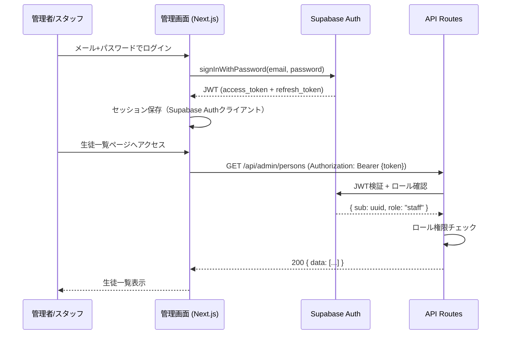

# 権限設計 — juku-ai-slack-bot

## 1. 権限モデル

- 方式: RBAC（Role-Based Access Control）
- 理由: ユーザー種別が3つと少なく、ロールと権限の対応がシンプル
- 実装: Supabase Auth（JWT） + PostgreSQL RLS

---

## 2. ロール定義

| ロール | 説明 | 割り当て方法 |
|--------|------|------------|
| admin | 管理者。全操作可能 | Supabase Auth **app_metadata**.role = 'admin' |
| staff | スタッフ。レポート作成・閲覧・エラー対応 | Supabase Auth **app_metadata**.role = 'staff' |
| (anon) | 未認証。/api/slack/eventsのみアクセス可 | - |

> 注意: SlackのBot・生徒・スタッフはSupabase Authのユーザーではない。管理画面利用者（スタッフ・管理者）のみSupabase Authに登録する。

> ⚠️ **セキュリティ**: ロールは必ず `app_metadata` に格納する。`user_metadata`（raw_user_meta_data）は
> ログイン中のユーザー自身が `supabase.auth.updateUser({ data: { role: 'admin' } })` で書き換えられるため、
> 権限判定に使うと**権限昇格**が可能になる。`app_metadata`（raw_app_meta_data）は Service Role /
> Admin API でしか変更できない。付与手順は「2.1 ロールの付与手順」を参照。

### 2.1 ロールの付与手順（サーバー側でのみ実行可能）

`app_metadata` はクライアントから設定できないため、admin/staff ロールは以下のいずれかで付与する。

**方法1: Supabase Admin API（Service Role キー使用・サーバー専用スクリプト等から）**

```typescript
await supabase.auth.admin.updateUserById(userId, {
  app_metadata: { role: 'admin' }, // または 'staff'
})
```

**方法2: SQL（Supabase Dashboard の SQL Editor）**

```sql
update auth.users
set raw_app_meta_data = raw_app_meta_data || '{"role":"admin"}'::jsonb
where email = 'staff@example.com';
```

- 付与後、対象ユーザーの**再ログイン後**に JWT へ反映される
- 現状の admin 限定操作は「Embedding 手動再生成（EP-14）」のみ。それ以外の管理画面操作は
  staff/admin 共通（requireStaff = 認証済みチェックのみ）のため、全管理画面ユーザーに
  少なくとも役割を示す `role` を付与しておくことを推奨

---

## 3. API権限マトリクス

| EP-ID | エンドポイント | admin | staff | anon |
|-------|-------------|-------|-------|------|
| EP-01 | POST /api/slack/events | ○（Slack署名） | ○（Slack署名） | ○（Slack署名） |
| EP-02 | GET /api/admin/persons | ○ | ○ | ✗ |
| EP-03 | POST /api/admin/persons | ○ | ○ | ✗ |
| EP-04 | GET /api/admin/persons/:id | ○ | ○ | ✗ |
| EP-05 | PATCH /api/admin/persons/:id | ○ | ○ | ✗ |
| EP-06 | PUT /api/admin/persons/:id/profile | ○ | ○ | ✗ |
| EP-07 | GET /api/admin/channel-bindings | ○ | ✗ | ✗ |
| EP-08 | POST /api/admin/channel-bindings | ○ | ✗ | ✗ |
| EP-09 | PATCH /api/admin/channel-bindings/:id | ○ | ✗ | ✗ |
| EP-10 | GET /api/admin/reports | ○ | ○ | ✗ |
| EP-11 | POST /api/admin/reports | ○ | ○ | ✗ |
| EP-12 | GET /api/admin/reports/:id | ○ | ○ | ✗ |
| EP-13 | PATCH /api/admin/reports/:id | ○ | ○ | ✗ |
| EP-14 | POST /api/admin/reports/:id/rebuild-embeddings | ○ | ✗ | ✗ |
| EP-15 | GET /api/admin/usage | ○ | ○（閲覧のみ） | ✗ |
| EP-16 | GET /api/admin/errors | ○ | ○ | ✗ |
| EP-17 | PATCH /api/admin/errors/:id | ○ | ○ | ✗ |
| EP-18 | GET /api/admin/threads | ○ | ○ | ✗ |

---

## 4. RLS ポリシー

> 管理画面APIはService Roleを使用するためRLSをバイパスする。
> RLSは主に「将来的なクライアント直接アクセスへの防御」として設定する。

> 補足: 以下の例にある `auth.jwt()->>'role'` は Supabase の予約 role claim（`authenticated` /
> `anon` 等）を指し、上記 2.1 のカスタムロール（app_metadata.role）とは**別物**。
> 管理画面は Service Role で RLS をバイパスする設計のため、実際の admin/staff 権限判定は
> アプリ層の `requireStaff` / `requireAdmin`（= app_metadata.role）が担う。

### 4.1 基本方針
- すべてのテーブルでRLSを有効化
- APIサーバー（Next.js）はService Roleを使用（RLSバイパス）
- 直接Supabaseクライアントからのアクセスにはauthenticatedロールを使用

```sql
-- 全テーブルに適用する基本ポリシー
-- アノニマスユーザーの直接アクセスは全て拒否
CREATE POLICY "deny_anon" ON {table} 
  FOR ALL TO anon USING (false);

-- authenticatedユーザーは基本的に管理者・スタッフのみ（管理画面ユーザー）
-- Service Roleはバイパス
```

### 4.2 TBL-persons
```sql
ALTER TABLE persons ENABLE ROW LEVEL SECURITY;

-- 管理画面ユーザー（staff/admin）は全件閲覧可
CREATE POLICY "persons_select_authenticated" ON persons
  FOR SELECT TO authenticated USING (true);

-- 書き込みはService Roleのみ（管理画面API経由）
CREATE POLICY "persons_insert_service" ON persons
  FOR INSERT TO authenticated
  WITH CHECK (
    (auth.jwt()->>'role')::text IN ('admin', 'staff')
  );
```

### 4.3 TBL-reports
```sql
ALTER TABLE reports ENABLE ROW LEVEL SECURITY;

CREATE POLICY "reports_select_authenticated" ON reports
  FOR SELECT TO authenticated USING (true);

CREATE POLICY "reports_modify_authenticated" ON reports
  FOR ALL TO authenticated
  USING ((auth.jwt()->>'role')::text IN ('admin', 'staff'))
  WITH CHECK ((auth.jwt()->>'role')::text IN ('admin', 'staff'));
```

### 4.4 TBL-report_chunks（RAGベクトル検索）
```sql
ALTER TABLE report_chunks ENABLE ROW LEVEL SECURITY;

-- ベクトル検索関数はService Role経由で実行するため、
-- RLSでperson_idフィルタを強制する
CREATE POLICY "chunks_own_person_only" ON report_chunks
  FOR SELECT TO authenticated
  USING (true); -- Service Roleがperson_idでフィルタを保証
```

### 4.5 TBL-ai_usage_logs / TBL-ai_error_logs
```sql
-- 読み取り専用（管理画面スタッフも閲覧可）
-- 書き込みはService Roleのみ
ALTER TABLE ai_usage_logs ENABLE ROW LEVEL SECURITY;
CREATE POLICY "usage_logs_read_authenticated" ON ai_usage_logs
  FOR SELECT TO authenticated USING (true);

ALTER TABLE ai_error_logs ENABLE ROW LEVEL SECURITY;
CREATE POLICY "error_logs_read_authenticated" ON ai_error_logs
  FOR SELECT TO authenticated USING (true);
CREATE POLICY "error_logs_update_authenticated" ON ai_error_logs
  FOR UPDATE TO authenticated
  USING ((auth.jwt()->>'role')::text IN ('admin', 'staff'))
  WITH CHECK ((auth.jwt()->>'role')::text IN ('admin', 'staff'));
```

---

## 5. 認証フロー



---

## 6. Slack Botのデータアクセス

Slack Bot（非同期ジョブworker）はSupabase Auth認証を持たない。Service Roleで直接DBにアクセスする。

```
SUPABASE_SERVICE_ROLE_KEY → 環境変数（サーバーサイドのみ）
```

データアクセス時は必ず `person_id` でフィルタし、他の生徒データへのアクセスを防ぐ。

---

## 7. セキュリティ考慮事項

| 項目 | 対応 |
|------|------|
| JWTトークン有効期限 | Supabase Authデフォルト（1時間）。refresh_tokenで自動更新 |
| CORS | Vercel管理、本番ドメインのみ許可 |
| Slack署名検証 | EP-01でHMAC-SHA256検証必須。タイムスタンプ5分制限 |
| Service Role漏洩防止 | サーバーサイドのみ。クライアントサイドのビルドバンドルに含まない |
| 生徒間データ越境防止 | Bot処理は必ずchannel_id→person_idを解決してからDBアクセス |
| HTTPS | Vercelで自動対応 |
| レート制限 | Vercel Edge / Next.js Middlewareで `/api/admin/*` に適用 [仮決定] |
| Supabase Row Level Security | 全テーブルRLS有効化（Service Roleバイパスを前提） |
