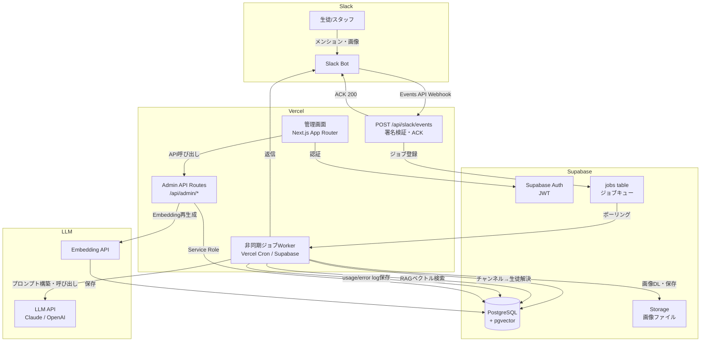
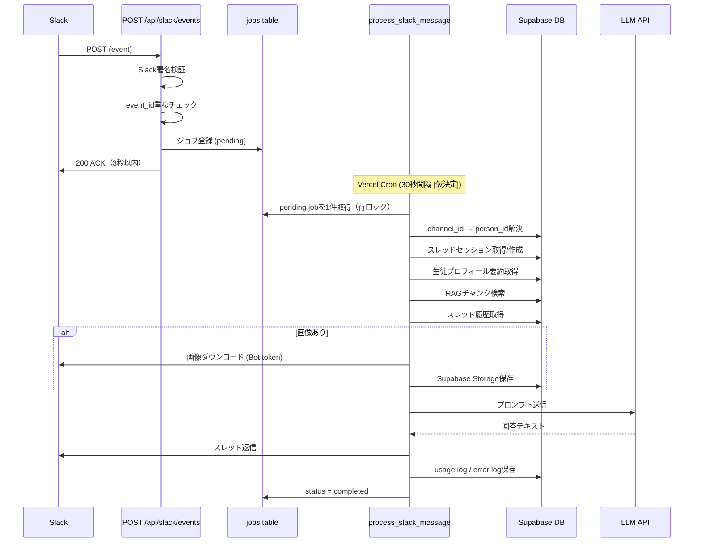

# アーキテクチャ設計 — juku-ai-slack-bot

## 1. アーキテクチャ概要

- **パターン**: モノリシック（Next.js App Router + Supabase BaaS）
- **選定理由**: 個人開発・数十人規模の塾向けシステムに対して、マイクロサービスは過剰設計。1つのリポジトリで管理画面UI・API・Slack Webhookを統合することで開発速度と保守性を両立する。将来的な機能追加もfeatures/配下を増やすだけで対応できる。

---

## 2. システム構成図



---

## 3. 技術スタック一覧

| カテゴリ | 技術 | バージョン | 選定理由 |
|---------|------|---------|---------|
| フレームワーク | Next.js (App Router) | 15.x | Vercel最適化・SSR/API Route統合・型安全 |
| 言語 | TypeScript | 5.x | 型安全・AIコード生成との相性 |
| DB/BaaS | Supabase | - | PostgreSQL+pgvector+Auth+Storage一体提供・無料枠あり |
| ORM/クライアント | Supabase JS Client | 2.x | Supabase生成型で型安全なDBアクセス |
| UIライブラリ | shadcn/ui + Tailwind CSS | - | カスタマイズ性・コンポーネント単位コピー・型安全 |
| フォーム | React Hook Form + Zod | - | 型安全バリデーション・パフォーマンス |
| サーバーステート | TanStack Query (React Query) | 5.x | キャッシュ管理・楽観的更新・エラー処理 |
| テスト (Unit/Integration) | Vitest | - | TypeScript親和性・高速・Jestと互換 |
| テスト (E2E) | Playwright | - | 信頼性・自動化・デバッグ容易 |
| モック | MSW | 2.x | 外部API（Slack/LLM）のモック |
| ホスティング | Vercel | - | Next.jsとの親和性・自動デプロイ・Edge Functions |
| CI/CD | GitHub Actions | - | 無料枠十分・Vercel連携 |
| コード品質 | ESLint + Prettier | - | 標準的・設定が容易 |
| LLM（未確定） | Claude claude-sonnet-4-6 / GPT-4o | - | [仮決定] 両対応の設計にする |
| Embedding（未確定） | text-embedding-3-small | - | [仮決定] 1536次元 |
| 非同期ジョブ | Supabase job table + Vercel Cron | - | MVP初期。将来Inngest移行可 |

---

## 4. レイヤー構成

```
プレゼンテーション層
  src/app/          — ルーティング・ページコンポーネント（Server Components優先）
  src/features/*/components/ — 機能固有UIコンポーネント

アプリケーション層
  src/features/*/actions/  — Server Actions（業務フロー調整）
  src/app/api/             — API Routes（Webhook受信・Admin API）

ドメイン層
  src/lib/slack/           — Slack署名検証・反応制御・メッセージ送信
  src/lib/ai/              — プロンプト構築・AI API呼び出し・コスト計算
  src/lib/rag/             — チャンク分割・embedding生成・ベクトル検索
  src/lib/jobs/            — ジョブ登録・処理・リトライ

インフラ層
  src/lib/supabase/        — DBクライアント（Service Role / Browser）
  supabase/migrations/     — DBマイグレーション
  supabase/seed.sql        — シードデータ
```

---

## 5. Slack Bot データフロー



---

## 6. 設計原則

- **Server Components First**: データフェッチはServer Components、インタラクションのみClient
- **features単位の機能凝集**: 機能を消したいときにフォルダごと消せる構造
- **型安全3層**: Supabase生成型 + Zod入力バリデーション + TypeScript strict mode
- **エラーバウンダリ**: 各機能でエラーを捕捉し、ユーザーに伝えるものと内部ログに留めるものを分離
- **@implementsタグ必須**: 全ファイル冒頭に `@implements FR-XX, AC-XX-XX` を付与（Phase 4 drift検出の根拠）
- **ACK優先**: Slack Webhookは即ACK → 非同期ジョブで処理分離
- **ゼロダウンタイムデプロイ**: Vercelの自動ロールバック機能を活用
