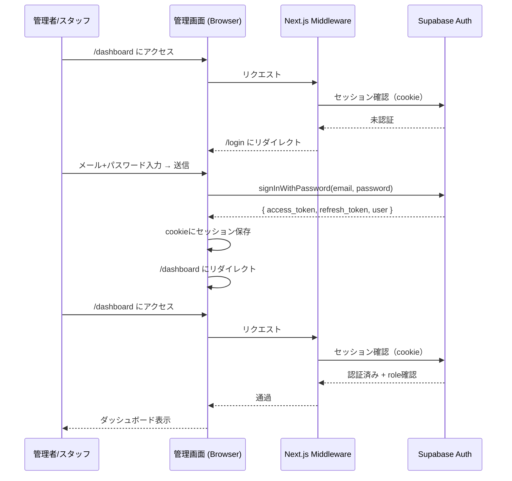
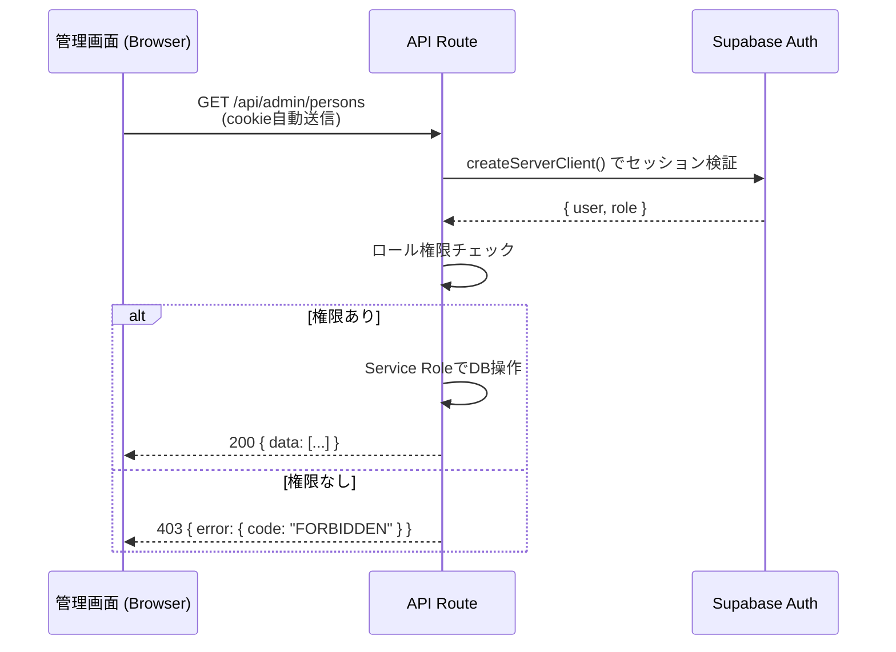
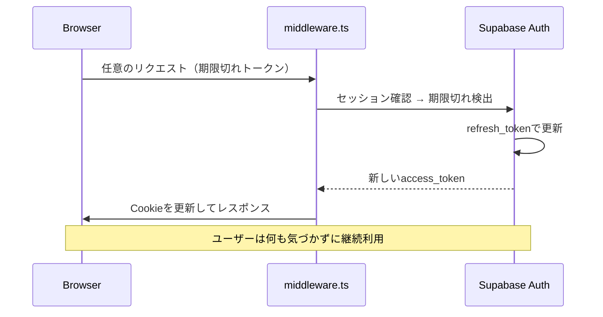

# 認証フロー — juku-ai-slack-bot

## 1. 認証方式

| 対象 | 方式 | 詳細 |
|------|------|------|
| 管理画面ユーザー（スタッフ・管理者） | Supabase Auth（メール+パスワード） | JWT発行。ロールはuser_metadataで管理 |
| Slack Bot | Service Role Key（環境変数） | Supabase Auth外。サーバーサイドのみ使用 |
| 生徒 | なし（Slackユーザーとして間接認証） | person_idはchannel_idから解決 |

---

## 2. セッション管理

| 項目 | 設定 |
|------|------|
| アクセストークン期限 | 1時間（Supabase Authデフォルト） |
| リフレッシュトークン期限 | 7日間（Supabase Authデフォルト） |
| セッション保持 | Supabase SSR helpers（cookie based） |
| セッション更新 | Supabase middleware で自動refresh |

---

## 3. 認証フロー詳細

### 3.1 ログインフロー



### 3.2 APIリクエスト認証フロー



### 3.3 セッション自動更新（Middleware）



---

## 4. Middleware設計

```typescript
// middleware.ts
import { createServerClient } from '@supabase/ssr'
import { NextResponse } from 'next/server'
import type { NextRequest } from 'next/server'

export async function middleware(request: NextRequest) {
  let response = NextResponse.next({ request })

  const supabase = createServerClient(
    process.env.NEXT_PUBLIC_SUPABASE_URL!,
    process.env.NEXT_PUBLIC_SUPABASE_ANON_KEY!,
    { cookies: { /* cookie helper */ } }
  )

  // セッション更新（自動refresh）
  const { data: { user } } = await supabase.auth.getUser()

  // 保護ルートへの未認証アクセスをリダイレクト
  const isProtectedRoute = request.nextUrl.pathname.startsWith('/dashboard') ||
    request.nextUrl.pathname.startsWith('/persons') ||
    request.nextUrl.pathname.startsWith('/reports') ||
    request.nextUrl.pathname.startsWith('/bindings') ||
    request.nextUrl.pathname.startsWith('/errors') ||
    request.nextUrl.pathname.startsWith('/logs')

  if (isProtectedRoute && !user) {
    return NextResponse.redirect(new URL('/login', request.url))
  }

  // ログイン済みユーザーがloginページにアクセスした場合
  if (request.nextUrl.pathname === '/login' && user) {
    return NextResponse.redirect(new URL('/dashboard', request.url))
  }

  return response
}

export const config = {
  matcher: ['/((?!api|_next/static|_next/image|favicon.ico).*)'],
}
```

---

## 5. ロール管理

**ロールの付与方法**:
```typescript
// Supabase Authのuser_metadataにroleを設定
// Supabaseコンソールまたは管理者がSQL実行
UPDATE auth.users
SET raw_user_meta_data = jsonb_set(
  raw_user_meta_data,
  '{role}',
  '"admin"'
)
WHERE email = 'admin@example.com';
```

**APIでのロール確認**:
```typescript
// src/lib/supabase/auth.ts
export async function getAuthUser(request: Request) {
  const supabase = createServerClient(/* ... */)
  const { data: { user }, error } = await supabase.auth.getUser()
  
  if (error || !user) {
    throw new AuthError('UNAUTHORIZED')
  }
  
  const role = user.user_metadata?.role as 'admin' | 'staff' | undefined
  if (!role) throw new AuthError('FORBIDDEN')
  
  return { user, role }
}
```

---

## 6. セキュリティ対策

| 攻撃手法 | 対策 | 実装方法 |
|---------|------|---------|
| CSRF | SameSite=Lax Cookie + Supabase Auth管理 | Supabaseデフォルト |
| XSS | React デフォルトエスケープ + CSPヘッダー | next.config.js で設定 |
| セッションハイジャック | HTTPOnly Cookie + HTTPS強制 | Supabase Authデフォルト |
| ブルートフォース | Supabase Auth レートリミット | デフォルト有効 |
| 権限昇格 | APIでのロール確認 + Service Roleサーバー限定 | 各API Routeで実装 |
| Replay攻撃（Slack） | タイムスタンプ5分チェック | FR-01 BR-01-02 |
| 不正Webhook | Slack HMAC署名検証 | FR-01 BR-01-01 |

---

## 7. エラーハンドリング

| エラー | ユーザー向け文言 | 処理 |
|--------|----------------|------|
| 未認証 | ログインページへリダイレクト | Middlewareでリダイレクト |
| 認証失敗（ログイン） | 「メールアドレスまたはパスワードが正しくありません」 | エラーメッセージ表示 |
| 権限不足 | 「この操作を行う権限がありません」 | 403レスポンス |
| セッション期限切れ | 自動refresh → 失敗時はログインページへ | Middlewareで処理 |
| Slack署名検証失敗 | なし（ユーザー通知不要） | 401を返してログ記録 |
