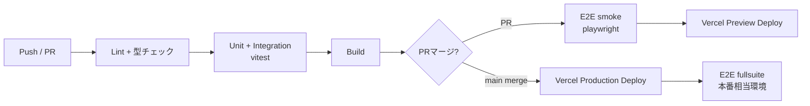

# 開発ガイドライン — juku-ai-slack-bot

## 1. 環境構築手順

```bash
# 1. リポジトリクローン
git clone https://github.com/{user}/juku-ai-slack.git
cd juku-ai-slack

# 2. 依存関係インストール
pnpm install

# 3. 環境変数設定
cp .env.example .env.local
# .env.local に各値を設定

# 4. Supabase ローカル起動
pnpm supabase start
pnpm supabase db reset   # マイグレーション + seedデータ投入

# 5. 開発サーバー起動
pnpm dev
# → http://localhost:3000
```

---

## 2. Git 運用

| 項目 | ルール |
|------|--------|
| ブランチ戦略 | GitHub Flow（main直接pushなし） |
| ブランチ命名 | `feature/{issue番号}-{topic}` / `fix/{issue番号}-{topic}` |
| コミット形式 | Conventional Commits（`feat:` / `fix:` / `docs:` / `refactor:` / `test:`） |
| PRマージ | Squash merge（main履歴を綺麗に保つ） |
| レビュー | セルフレビュー必須。重要変更はAIレビューも活用 |

---

## 3. コーディング規約

- TypeScript strict mode必須（`"strict": true`）
- `any`型禁止（`unknown` + 型ガード使用）
- 関数の戻り値型は明示する
- マジックナンバー禁止（`src/lib/constants.ts`に定数化）
- エラーはカスタムエラークラスかAppError型でthrow
- コンポーネントは1責務。100行超は分割検討

---

## 4. AI生成コード規約

### 4.1 ファイル冒頭コメント（必須）

すべての機能ファイルに以下を付与する:

```typescript
/** @file
 * 機能: {1行要約}
 * 入力: {引数・FormDataの型と形式}
 * 出力: {戻り値の型と形式}
 * 例外: {エラーコードとHTTPステータス}
 * 依存: {環境変数・主要importモジュール}
 * 副作用: {DB書き込み・外部API・Slack送信}
 * セキュリティ: {ID検証・RLS・Service Roleの扱い}
 * @implements FR-01, AC-01-01, AC-01-02
 */
```

**`@implements` タグは必須**。Phase 4（整合性チェック）が機械的に逆引きする根拠になる。
- 該当するFR-XX、AC-XX-XXを全て列挙する
- リファクタで対象が変わったら更新する
- shared/utilityで機能IDに対応しない場合は `@implements -` と明記

### 4.2 テストファイル

```typescript
/** @file
 * 検証: {何をテストするか}
 * @verifies AC-01-01, AC-01-02
 */
```

### 4.3 AI生成コードの必須チェック

PRマージ前に確認:
- [ ] 入出力の型が明示されているか
- [ ] エラーハンドリングが全ケース網羅されているか
- [ ] 環境変数の存在チェックがあるか（サーバー起動時に検証）
- [ ] ユーザーID・person_idの出所がchannel_id解決か確認されているか
- [ ] Service Role Keyがクライアントに露出していないか
- [ ] テストが同時に生成されているか
- [ ] **@implements タグが付与されているか**

---

## 5. コンポーネント設計

- **Server Componentsがデフォルト**。データフェッチはServer Componentsで行う
- `"use client"`はツリーの末端（インタラクションが必要な箇所のみ）
- Props型は同ファイルに `type Props = {...}` で定義してexport
- 大きいコンポーネントは Presentational（表示のみ）と Container（ロジック）に分離

```typescript
// 例: Server Component でデータ取得
// src/features/persons/components/PersonList.tsx
import { getPersons } from '../actions/getPersons'

export async function PersonList() {
  const persons = await getPersons()  // サーバーで実行
  return <PersonTable data={persons} />
}

// src/features/persons/components/PersonTable.tsx
"use client"  // インタラクション（ソート・フィルタ）が必要
export function PersonTable({ data }: { data: Person[] }) { ... }
```

---

## 6. エラーハンドリング

### 統一エラー型

```typescript
// src/lib/errors/types.ts
export type AppError = {
  code: string      // FR-11のエラーコード一覧に対応
  message: string   // ユーザー向け文言
  status: number
  details?: unknown
}

export class AppException extends Error {
  constructor(public readonly appError: AppError) {
    super(appError.message)
  }
}
```

### レイヤー別責務

| レイヤー | 責務 |
|---------|------|
| API Route（Slack Webhook） | try-catch → エラーコードでSlackに返信 → ai_error_logsに保存 |
| API Route（Admin API） | try-catch → AppError JSON → HTTPステータス返却 |
| Server Action | try-catch → AppError返却（throw不可） |
| Clientコンポーネント | error.tsx + ErrorBoundary + Toast通知 |
| Sentry | >= 500レベルは自動送信 |

---

## 7. テスト規約

- **Unit**: ビジネスロジック・ユーティリティは必須（`src/lib/`配下全件）
- **Integration**: API Routes・DB操作は必須（`src/__tests__/integration/`）
- **E2E**: 主要フロー必須（`tests/e2e/`）
- テスト名: 「〜した場合、〜になる」形式（日本語可）
- AAAパターン（Arrange-Act-Assert）を徹底
- 外部API（LLM / Slack）はMSWでモック必須

---

## 8. PRテンプレート

```markdown
## 概要
<!-- 何を・なぜ変更したか -->

## 変更内容
- 

## 関連
- FR-XX: {機能名}
- AC-XX-XX: {受入基準}

## テスト
- [ ] `pnpm test` 通過
- [ ] `pnpm typecheck` 通過
- [ ] `pnpm lint` 通過

## チェックリスト
- [ ] `@implements` タグが付与されているか
- [ ] Service Role Keyがクライアントに露出していないか
- [ ] 生徒間のデータ越境がないか（person_idフィルタ）
- [ ] エラーがユーザーに内部詳細を返していないか
- [ ] コスト暴走リスクがないか（LLM API呼び出し回数）
```

---

## 9. ESLint / Prettier 設定

```json
// .eslintrc.json
{
  "extends": ["next/core-web-vitals", "plugin:@typescript-eslint/recommended"],
  "rules": {
    "@typescript-eslint/no-explicit-any": "error",
    "@typescript-eslint/explicit-function-return-type": "warn",
    "no-console": ["warn", { "allow": ["error", "warn"] }]
  }
}
```

```json
// .prettierrc
{
  "semi": false,
  "singleQuote": true,
  "tabWidth": 2,
  "trailingComma": "es5",
  "printWidth": 100
}
```

---

## 10. CI/CDパイプライン



```yaml
# .github/workflows/ci.yml（概要）
name: CI
on: [push, pull_request]
jobs:
  lint-typecheck:
    runs-on: ubuntu-latest
    steps:
      - uses: actions/checkout@v4
      - run: pnpm install
      - run: pnpm lint && pnpm typecheck

  test:
    needs: lint-typecheck
    services:
      supabase: # Supabase CLI でローカルDB起動
    steps:
      - run: pnpm supabase start
      - run: pnpm supabase db reset
      - run: pnpm test --coverage

  e2e:
    needs: test
    if: github.event_name == 'pull_request'
    steps:
      - run: pnpm playwright test --grep @smoke
```

---

## 11. 環境変数検証（起動時チェック）

```typescript
// src/lib/env.ts
// サーバー起動時に必須変数の存在を検証
const requiredServerEnvs = [
  'SUPABASE_SERVICE_ROLE_KEY',
  'SLACK_BOT_TOKEN',
  'SLACK_SIGNING_SECRET',
  'SLACK_BOT_USER_ID',
  'ANTHROPIC_API_KEY',
] as const

for (const key of requiredServerEnvs) {
  if (!process.env[key]) {
    throw new Error(`Missing required environment variable: ${key}`)
  }
}
```
