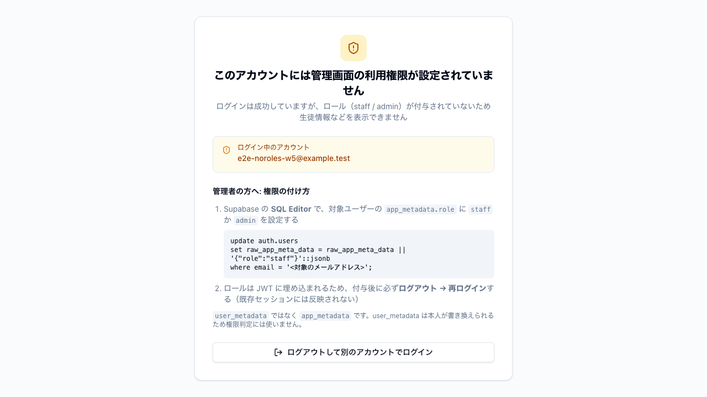
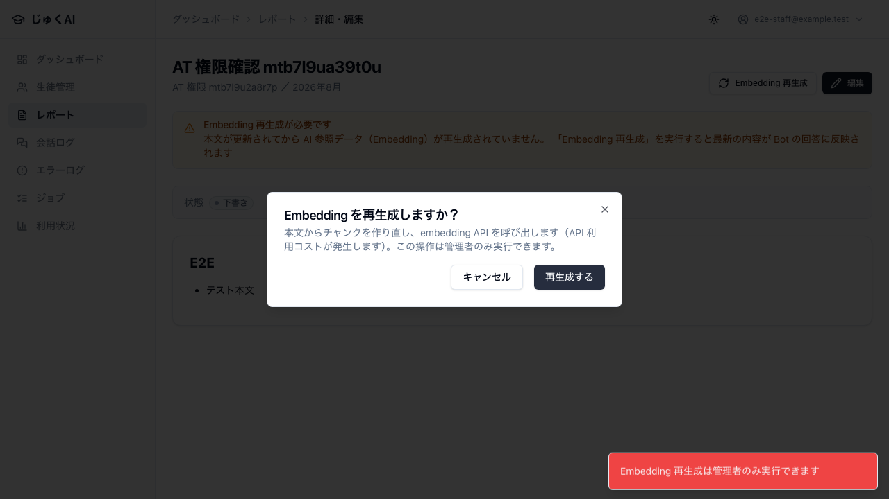
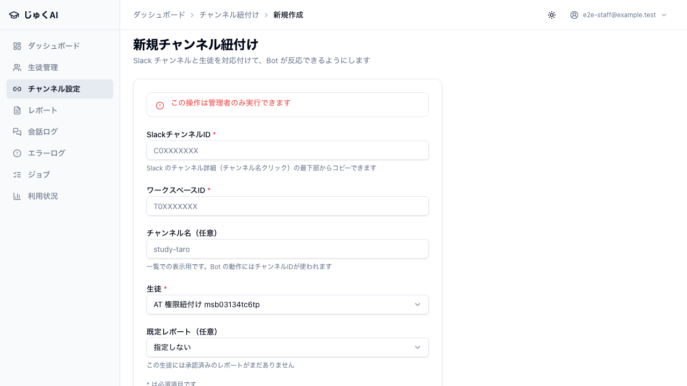

# 10. 認証・認可

実施日: 2026-08-02 / commit `89dac7e` / 結果: **17 ケース PASS・FAIL 0**

このカテゴリは「**ログインできただけの人に、生徒の個人情報が渡らないか**」を確かめる。
本システムで最も守るべき資産は `persons` / `student_profiles` / `slack_messages` に入る
生徒の氏名・学年・質問本文なので、ここが崩れると公開できない。

防御は 2 層あり、それぞれ別のケースで検証している。**片方を見てもう片方を判定しない**こと。

| 層 | 何を塞ぐか | 実装 | 検証ケース |
|---|---|---|---|
| DB 層（RLS + GRANT） | ブラウザから anon key + 自分の JWT で PostgREST を直接叩く経路 | migration `024_fix_service_role_grants.sql` / `026_harden_rls_policies.sql` | AT-06, AT-08〜AT-11 |
| アプリ層（`requireStaff` / `requireStaffPage` / `requireAdmin`） | 管理画面。**Service Role で動くため RLS を通らない** | `src/shared/lib/auth/` | AT-05, AT-05b, AT-12, AT-13, AT-B04〜AT-B07 |

---

## AT-05 ロールなしユーザーは管理画面を利用できない ★発見 → 修正済み

**優先度**: 必須 / **実施方法**: acceptance spec（`e2e/acceptance/security-rls.spec.ts`）

### 経緯 — このケースは公開ブロッカーを 1 件検出している

当初、**「サインアップできただけで role を持たないユーザーが、管理画面から全生徒の PII を閲覧・編集できる」** 状態だった。

- migration 026 で RLS を強化したが、これが塞ぐのは **PostgREST 直アクセスだけ**。
- 管理画面は Service Role で DB に接続するため **RLS を迂回する**。
- 当時の `requireStaff()` は「認証されているか」しか見ておらず、`app_metadata.role` を検証していなかった。
- 結果、Supabase Auth にアカウントさえあれば `/admin/persons` で全生徒が見えた。

自動テストの設計（ロールを持つユーザーでの操作）では出ず、
**「権限を持たない人の視点で実際に操作する」受け入れテストだから見つかった**類の欠陥。

**修正（W5-A）**: `requireStaff` / `requireStaffPage` が `app_metadata.role ∈ {staff, admin}` を厳密比較で検証するようにした。
`user_metadata` は判定に一切使わない（本人が書き換えられるため）。
未認証（unauthorized）と権限なし（forbidden）を分離し、後者は専用ページ `/admin/no-access` に案内する。
`/login` へ戻さないのは、ログイン自体は成功しており、戻すと無限ループに見えるため。

本ケースは現在「**修正後の挙動が維持されていること**」を検証するリグレッションテストとして機能している。

### 目的

role を持たないユーザーが、管理画面のどのページにも到達できないこと。
到達できないだけでなく、**何が起きているかと次に何をすべきかが本人に伝わる**こと。

### 前提

- `app_metadata` が空のユーザー `e2e-noroles-w{worker}@example.test` を Admin API で作成（`upsertRolelessUser`）
- 生徒データを 1 件以上投入済み（「行が無いから見えない」との混同を避けるため）

### 手順

1. `/login` でロールなしユーザーの資格情報を入力しログイン
2. 着地先 URL を確認
3. `/admin/persons` を URL で直接開く

### 期待結果

- ログインは成功する（アカウント自体は有効）
- 着地先は `/admin` ではなく `/admin/no-access`
- `/admin/persons` を直接叩いても `/admin/no-access` にリダイレクト（middleware だけでなくページ側でも弾く）
- 見出し「このアカウントには管理画面の利用権限が設定されていません」が表示される
- 「生徒管理」の h1 は **0 件**（部分描画すら起きない）
- ログイン中のメールアドレスと「ログアウトして別のアカウントでログイン」ボタンが出る

### 実結果

PASS。全アサーション通過。`/admin/persons` は `/\/admin\/no-access$/` にリダイレクトされ、生徒名は 1 件も描画されなかった。

### 証拠

`evidence/AT-05_ロールなしユーザーは管理画面を利用できない.png`

### 保証すること / しないこと

- **保証する**: アプリ層（Server Component / Server Action）で role が検証されていること。
- **保証しない**: PostgREST 直アクセスの遮断（それは AT-08〜AT-11 の担当）。
- **保証しない**: 本番 Supabase で「新規サインアップ無効化」が設定されていること。これは
  migration 026 のコメントにある**運用手順**であり、テストの射程外
  → `90_本番疎通チェックリスト.md` / セットアップガイド STEP 2 で確認する。

---

## AT-05b user_metadata に role を自称しても管理画面には入れない

**優先度**: 必須 / **実施方法**: acceptance spec

### 目的

権限昇格の典型的な攻め筋を塞げていること。Supabase では `user_metadata` は**本人が書き換えられる**ため、
ここを role の判定に使うと自己昇格が成立してしまう。

### 前提

ロールなしユーザーで `PUT /auth/v1/user` を叩き、`user_metadata.role = 'admin'` を自分で設定した状態。

### 手順

1. `selfSetUserMetadata(token, { role: 'admin' })` を実行（この API 呼び出し自体は 200 で成功する）
2. `/login` からログイン
3. admin 限定画面 `/admin/channels/new`（EP-07〜09）を開く

### 期待結果

- ログイン後の着地は `/admin/no-access`
- `/admin/channels/new` も `/admin/no-access` にリダイレクト
- 「SlackチャンネルID」入力欄が **0 件**（フォームに到達すらしない）

### 実結果

PASS。`user_metadata` の自己更新は成功するが、認可判定には一切影響しなかった。

### 証拠

`evidence/AT-05b_user_metadata自称では管理者操作に昇格できない.png`

> スクリーンショットは AT-05 と同一の `/admin/no-access` 画面になる（同じユーザー・同じ着地先のため）。
> 2 つのケースの違いは**到達しようとした経路**であり、画面ではなくテスト本文が差分を持つ。

---

## AT-06 user_metadata に role を自称しても RLS は突破できない

**優先度**: 必須 / **実施方法**: acceptance spec

### 目的

AT-05b の DB 層版。同じ自己昇格を PostgREST に対して試す。

### 手順

1. ロールなしユーザーでトークン取得
2. `user_metadata.role = 'admin'` を自己設定（200 が返ることも明示的に確認する）
3. **更新後に取り直した新しいトークン**で `GET /rest/v1/persons?select=*&limit=5`

### 期待結果

返却行が 0 件。migration 026 のポリシーは `app_metadata.role` のみを参照しているため。

### 実結果

PASS。0 行。

### 保証すること / しないこと

- **保証する**: RLS ポリシーが `user_metadata` を参照していないこと。
- **保証しない**: `app_metadata` を書き換えられないこと自体（それは Supabase の仕様であり、
  Service Role キーの秘匿という運用側の前提に依存する）。

---

## AT-08 ロールなしユーザーの JWT では保護テーブルを 1 行も読めない

**優先度**: 必須 / **実施方法**: acceptance spec

### 目的

migration 026 が実効していること。PII を含む全テーブルを網羅で確認する。

### 前提

`persons` に実データを 1 件投入済み。**「行が無いから 0 件」ではなく「拒否されて 0 件」**であることを担保するため。

### 手順

ロールなしユーザーの JWT + anon key で、以下 7 テーブルに `GET /rest/v1/{table}?select=*&limit=5`。

`persons` / `student_profiles` / `reports` / `slack_channel_bindings` / `slack_messages` / `ai_usage_logs` / `ai_error_logs`

### 期待結果

全テーブルで返却行 0 件。ステータスは 500 未満（サーバーエラーではなく、意図した拒否であること）。

### 実結果

PASS。7 テーブルすべて 0 行。

---

## AT-09 未認証（anon key のみ）では保護テーブルを 1 行も読めない

**優先度**: 必須 / **実施方法**: acceptance spec

### 目的

anon key が漏れた場合（クライアントバンドルに含まれるので**漏れる前提**で考える必要がある）の被害範囲。

### 手順

JWT を付けず anon key のみで、AT-08 と同じ 7 テーブルに SELECT。

### 期待結果

全テーブル 0 行。migration 026 は anon 向けポリシーを 1 件も作らないため、RLS のデフォルト拒否で全面遮断される。

### 実結果

PASS。7 テーブルすべて 0 行。

---

## AT-10 ロールなしユーザーは persons を書き換えられない

**優先度**: 必須 / **実施方法**: acceptance spec

### 目的

読み取りだけでなく**書き込み**も塞がっていること。`persons` は `channel_id` と並ぶ信頼の基点（BR-07-01）なので、
ここに任意の行を挿せると紐付けの前提が崩れる。

### 手順

ロールなしユーザーの JWT で `POST /rest/v1/persons`（`name` / `grade` / `status` を指定）。

### 期待結果

HTTP 401 または 403。migration 026 は `authenticated` に INSERT の WITH CHECK ポリシーを作っていないため、
ポリシー不在で拒否される。

### 実結果

PASS。

---

## AT-11 staff ロールの JWT でも PostgREST からは PII を読めない（多層防御）

**優先度**: 必須 / **実施方法**: acceptance spec

### 目的

**設計より厳しい方向にズレている**ことの記録。これは不具合ではないが、
「staff なら REST から読めるはず」と考えて調査すると混乱するため、挙動を固定して残す。

### 背景

- migration 026 は staff/admin に SELECT ポリシーを作っている。
- しかし migration 024（GRANT 整理）で `authenticated` ロールからテーブル権限自体を剥奪している
  （残っているのは TRUNCATE / TRIGGER / REFERENCES のみ）。
- GRANT は RLS ポリシー評価より**前**に効くため、staff でも 403 になる。

### 手順

staff ユーザーの JWT + anon key で `GET /rest/v1/persons`。

### 期待結果

- HTTP **403**
- レスポンス本文に `permission denied` を含む
- 返却行 0 件

### 実結果

PASS。403 / `permission denied`。

### 影響評価

アプリ本体は Service Role で動くため**機能影響なし**。
結果として「ブラウザに届く経路には PII が 1 行も出ない」ことが確定しており、安全side のズレ。
Supabase Studio / REST での目視確認をしたい場合は Service Role が必要になる点だけ運用に伝える。
→ `91_既知の制約.md` OBS-01

---

## AT-12 staff は Embedding 再生成を実行できない

**優先度**: 必須 / **実施方法**: acceptance spec / **要件**: EP-14 / BR-16-02

### 目的

Server Action は URL から直接叩けるため、**UI の出し分けではなくサーバー側の `requireAdmin` が効いている**こと。
staff にもボタンは見えている状態でクリックさせ、サーバーが拒否することを確認する。

### 前提

staff の `storageState` でログイン。生徒 1 名 + レポート 1 件を作成済み。

### 手順

1. `/admin/reports/{id}` を開く
2. 「Embedding 再生成」→ 確認ダイアログの「再生成する」をクリック

### 期待結果

トーストに「Embedding 再生成は管理者のみ実行できます」。Embedding は再生成されない。

### 実結果

PASS。

### 証拠

`evidence/AT-12_staffはEmbedding再生成が拒否される.png`

---

## AT-13 staff はチャンネル紐付けを作成できない

**優先度**: 必須 / **実施方法**: acceptance spec / **要件**: EP-07〜09 / D-3

### 目的

`channel_id` は「誰の質問か」を決める信頼の基点。ここを staff が書けると、
生徒 A のチャンネルを生徒 B に付け替えて他人の学習履歴を引き出せてしまう。

### 手順

staff でログインし `/admin/channels/new` でフォームを埋めて「紐付ける」。

### 期待結果

`role="alert"` に「この操作は管理者のみ実行できます」。紐付けは作成されない。

### 実結果

PASS。

### 証拠

`evidence/AT-13_staffはチャンネル紐付けを作成できない.png`

---

## AT-14 anon key を持っていても Slack Webhook は署名なしで拒否される

**優先度**: 必須 / **実施方法**: acceptance spec

### 目的

`/api/slack/events` は公開エンドポイント。Supabase の anon key は防御に一切関与せず、
**Slack 署名だけが唯一の入口の鍵**であることを確認する。

### 手順

`apikey: {ANON_KEY}` ヘッダ付きで、Slack 署名ヘッダなしに `POST /api/slack/events`。

### 期待結果

HTTP 401。

### 実結果

PASS。

---

## 基礎 E2E で担保しているケース

以下は受け入れテスト spec ではなく、`e2e/` 直下の基礎 E2E が継続的に守っている。
すべて同じ実行（86 pass）に含まれる。

| ID | 内容 | spec | Playwright テスト数 | 結果 |
|---|---|---|---|---|
| AT-B01 | 未認証で保護パス 12 種がすべて `/login` にリダイレクト（`/admin/no-access` を含む） | `e2e/auth-guard.spec.ts` | 12 | PASS |
| AT-B02 | ログイン画面: 見出し/フォーム表示・入力 type（email / password）・必須未入力で送信されない・誤資格情報でエラー表示 | `e2e/login.spec.ts` | 4 | PASS |
| AT-B03 | ログアウト後に `/admin` を開くと `/login` に戻る | `e2e/logout.spec.ts` | 1 | PASS |
| AT-B04 | staff は Embedding 再生成を実行できない（確認ダイアログ文言も検証） | `e2e/permissions.spec.ts` | 1 | PASS |
| AT-B05 | staff はチャンネル紐付けを作成できない | `e2e/permissions.spec.ts` | 1 | PASS |
| AT-B06 | **ロールを持つ** staff が `/admin/no-access` を開くと `/admin` へ戻される（リダイレクト往復なし） | `e2e/permissions.spec.ts` | 1 | PASS |
| AT-B07 | staff でもダッシュボードと一覧は閲覧できる（締めすぎていないことの確認） | `e2e/permissions.spec.ts` | 1 | PASS |

AT-B06 / AT-B07 は AT-05 の修正が**過剰に効いていない**ことを守る。
`no-access` を導入するとリダイレクトループや、正当な staff の締め出しが起きやすいため、
逆方向のケースを対で置いている。

---

## このカテゴリの総括

| 観点 | 状態 |
|---|---|
| DB 層（PostgREST 直アクセス） | 全面遮断を確認（AT-06, AT-08〜AT-11） |
| アプリ層（管理画面） | role 検証を確認。当初の公開ブロッカーは修正済み（AT-05, AT-05b, AT-12, AT-13） |
| Webhook | 署名のみが鍵であることを確認（AT-14, AT-B21） |
| 運用前提（テスト射程外） | Supabase の新規サインアップ無効化 / Service Role キーの秘匿 → `90_本番疎通チェックリスト.md` |
