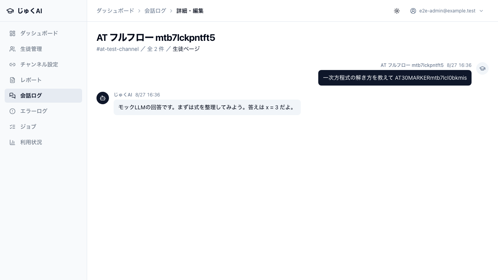
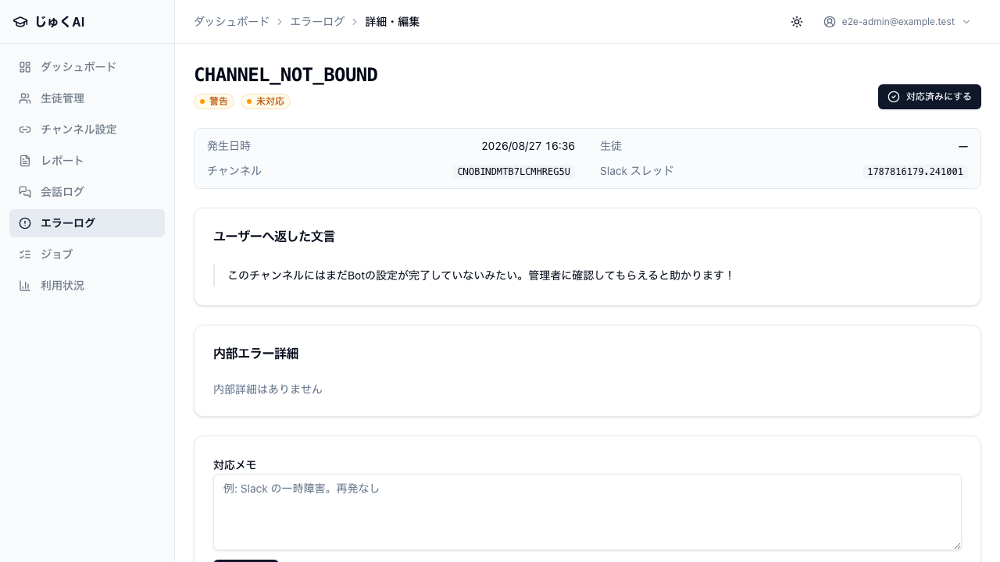
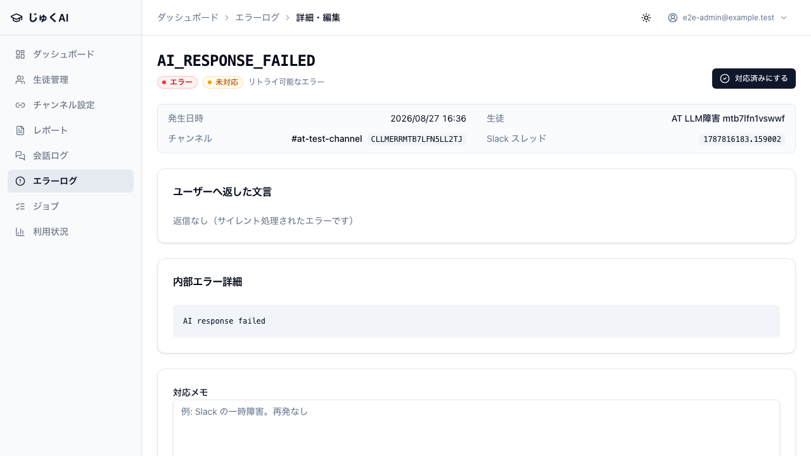

# 20. Slack フロー（イベント受信 → ジョブ → LLM → 返信）

実施日: 2026-08-02 / commit `89dac7e` / 結果: **12 ケース PASS・FAIL 0**

---

## この検証の構成 — 何が本物で、何がモックか

AT-30 系は「Slack から来た署名付きイベントが、回答として Slack に戻り、会話ログに残るまで」の**全経路**を通す。
ただし外部サービスは実物ではない。**この線引きを誤解すると、実 Slack での疎通確認を省略してしまう**ので明示する。

```
[Playwright]                [アプリ（next start, 本番ビルド）]        [モック]
  署名付き POST  ────────▶  /api/slack/events
  （実 HMAC-SHA256）          ├ 署名検証（本物）
                              ├ ACK 200 {ok:true}（本物）
                              └ after() でバックグラウンド処理
                                  ├ 紐付け解決（本物 / ローカル Postgres）
                                  ├ jobs への積み込み・状態遷移（本物）
                                  ├ reactions.add 🤔      ──────▶ mock-server.mjs
                                  ├ プロンプト構築（本物）
                                  ├ LLM 呼び出し           ──────▶ mock-server.mjs
                                  ├ 出力エスケープ（本物）
                                  ├ chat.postMessage       ──────▶ mock-server.mjs
                                  ├ reactions.remove 🤔    ──────▶ mock-server.mjs
                                  ├ slack_messages 記録（本物）
                                  └ ai_usage_logs 記録（本物）
```

| 要素 | 本物 / モック | 補足 |
|---|---|---|
| Slack 署名（HMAC-SHA256 v0） | **本物** | `e2e/acceptance/fixtures.ts: slackSign()` が実アルゴリズムで生成し、アプリ側の検証コードがそのまま通る |
| event_callback のペイロード形状 | **本物** | Slack の `message` イベント形式（`event_id` / `team_id` / `channel` / `ts` / `thread_ts` / `bot_id`） |
| ACK・ジョブ・DB・プロンプト構築・エスケープ | **本物** | 本番ビルド（`next start`）+ ローカル Postgres |
| Slack Web API（`chat.postMessage` / `reactions.add` / `reactions.remove`） | **モック** | `e2e/acceptance/mock-server.mjs`。`SLACK_API_BASE_URL` を向けている |
| LLM（OpenAI 互換 Chat Completions） | **モック** | 同上。`LLM_BASE_URL` を向けている |

**実 Slack API・実 LLM API は 1 回も呼んでいない。** これは意図的な設計で、
受け入れテストが課金を発生させず、外部障害で落ちず、決定的に再現するために必要。

モック LLM の応答はプロンプト中のマーカーで切り替わる（サーバー状態を持たないので並列実行に強い）:

| マーカー | 挙動 | 使うケース |
|---|---|---|
| （なし） | 通常回答 `モックLLMの回答です。…` / usage `prompt=123, completion=45` | AT-30, AT-37, AT-44b, AT-47 |
| `[[MOCK:INJECT]]` | 本文に `<!channel>` を含める | AT-35 |
| `[[MOCK:TRUNCATE]]` | `finish_reason=length` | AT-36 |
| `[[MOCK:FAIL]]` | HTTP 500 | AT-39 |
| `[[MOCK:RATELIMIT]]` | HTTP 429 | （実装済み・未使用） |

### モックだから確認できないこと

- 実 Slack の **3 秒 ACK タイムリミット**（ローカルは 1 リージョン・ゼロレイテンシ）
- Vercel の**コールドスタート**と `maxDuration=300` 下での実応答時間
- 実 LLM の応答品質・レイテンシ・実際のトークン単価
- Slack スコープ不足（`chat:write` / `files:read` 等）に起因するエラー
- 画像添付（実ファイルの `files.download` と Vision モデル）

→ すべて `90_本番疎通チェックリスト.md` に送っている。

---

## AT-30 メンション質問がジョブ経由で LLM に渡り、生成回答が Slack に投稿される

**優先度**: 必須 / **実施方法**: acceptance spec（`e2e/acceptance/slack-flow.spec.ts`）
**要件**: FR-01/02/03/04/12/19, AC-01-02, AC-01-06, AC-04-02

### 目的

このシステムの中核経路が端から端まで繋がっていること。ここが通らなければ他の何が動いても製品にならない。

### 前提

- 生徒 1 名 + `slack_channel_bindings` に active な紐付け
- kill_switch は稼働中（他 spec と共有ロックで排他。停止テストと並走すると `AI_PAUSED` で偽 FAIL になる）

### 手順

1. 一意なマーカー付きの本文 `<@{BOT}> 一次方程式の解き方を教えて {marker}` で署名付き event_callback を POST
2. モックへの呼び出しをポーリングで待つ
3. `/admin/conversations` から該当生徒の会話詳細を開く

### 期待結果

| # | 確認点 | 期待 |
|---|---|---|
| 1 | ACK | HTTP 200 / `{ok: true}`（AC-01-02） |
| 2 | LLM 呼び出し | ちょうど **1 回**。プロンプトに質問本文が載っている |
| 3 | Slack 投稿 | `chat.postMessage` の本文に生成回答が含まれる |
| 4 | 🤔 付与 | `reactions.add` の `name` が `thinking_face`（AC-01-06 / BR-05-08a） |
| 5 | 🤔 除去 | `reactions.remove` の `name` が `thinking_face` |
| 6 | ジョブ | `jobs.status = 'completed'`（AC-04-02） |
| 7 | 会話ログ | `/admin/conversations` の詳細に質問と回答が時系列で並ぶ（FR-19） |

### 実結果

PASS。7 点すべて確認。会話ログには質問「一次方程式の解き方を教えて」と回答「モックLLMの回答です」が
`message_ts` 順（質問 → 回答）で表示された。

### 証拠



`evidence/AT-30_Slackフルフロー_会話ログ詳細.png`

Slack への返信自体は画面に出ないため、**証拠は「人が管理画面で確認できる到達点」である会話ログ詳細**を撮っている。
Slack 側の投稿内容はモックサーバーの記録に対するアサーションで担保している。

### 保証すること / しないこと

- **保証する**: ACK → ジョブ → プロンプト → 投稿 → ログ記録の配線、および 🤔 のライフサイクル。
- **保証しない**: 回答の**内容品質**（モック LLM の固定文字列を返しているだけ）。
  実 LLM での回答品質は AT-P01 / AT-P02 で人が読んで判断する。

---

## AT-31 同じ event_id の再送では LLM を二度呼ばない

**優先度**: 必須 / **要件**: AC-01-04

### 目的

Slack は ACK が届かないと同じイベントを再送する。冪等でなければ、**同じ質問に 2 回課金し 2 回返信する**。

### 手順

1. 同一ボディ（同一 `event_id`）を 2 回 POST
2. 1 通目の LLM 呼び出しを待ってから 2 通目を送り、さらに 3 秒待つ

### 期待結果

- 2 通目も HTTP 200（Slack に再送をやめさせるため）
- LLM 呼び出しは通算 **1 回**のまま
- `ai_error_logs` に `SLACK_EVENT_DUPLICATE` が記録される（無視したことが運用で見える）

### 実結果

PASS。

---

## AT-32 未紐付けチャンネルには案内文言だけを返し LLM を呼ばない

**優先度**: 必須 / **要件**: AC-02-06 / BR-02-05

### 目的

紐付けの無いチャンネルは「誰の質問か」が決まらない。ここで LLM を呼ぶと、
**個人化なしの回答を誰のものとも分からないまま課金して返す**ことになる。

### 手順

紐付けを作らないチャンネル ID にメンション付きイベントを POST。

### 期待結果

- `chat.postMessage` の本文に「まだBotの設定が完了していない」を含む
- LLM 呼び出し **0 回**
- `ai_error_logs` に `CHANNEL_NOT_BOUND`

### 実結果

PASS。

### 証拠



`evidence/AT-32_未紐付けチャンネルの案内とエラー記録.png`
（`/admin/errors/{id}` のエラー詳細。エラーコード・チャンネル・内部詳細が写っている）

---

## AT-33 チャンネル直下でメンションが無ければ完全に無反応

**優先度**: 必須 / **要件**: AC-02-02 / BR-02-03

### 目的

生徒チャンネルには講師も入る。メンション無しの発言に反応すると**雑談に割り込む**。

### 手順

紐付け済みチャンネルに、メンションを含まない本文でイベントを POST。4 秒待つ。

### 期待結果

このチャンネル宛の Slack 呼び出しが **0 件**（投稿もリアクションも無し）。LLM 呼び出しも 0 回。

### 実結果

PASS。

---

## AT-34 退塾生（`persons.status='inactive'`）のチャンネルには一切投稿しない

**優先度**: 必須 / **要件**: H-6

### 目的

退塾後のチャンネルに Bot が喋ると事故になる。案内文すら出さず**無言で無視**する。

### 手順

紐付け済みの生徒を `status='inactive'` に更新してからメンション付きイベントを POST。

### 期待結果

- Slack 呼び出し **0 件**（案内文も出さない）
- ただし `ai_error_logs` に `PERSON_INACTIVE` は残る（運用で気づけるように）

### 実結果

PASS。「無言だがログには残る」という設計どおりの挙動を確認。

---

## AT-35 LLM 出力の `<!channel>` はエスケープされて投稿される

**優先度**: 必須 / **要件**: C-3（通知インジェクション）

### 目的

生徒が「`<!channel>` と書いて」と頼めば LLM はそう出力しうる。
エスケープしないと **Bot 経由でチャンネル全員にメンションを飛ばせる**。

### 手順

`[[MOCK:INJECT]]` マーカーでモック LLM に `<!channel>` 入りの回答を返させる。

### 期待結果

- 投稿本文に `&lt;!channel&gt;` を含む
- 投稿本文に生の `<!channel>` を **含まない**

### 実結果

PASS。

---

## AT-36 出力トークン上限で切れた回答には続きの案内が付く

**優先度**: 推奨 / **要件**: A-15 / G-3

### 目的

`finish_reason=length` で切れたとき、生徒に**途中で切れたと分かる**こと。
黙って切れると「AI が間違えた」と誤解される。

### 手順

`[[MOCK:TRUNCATE]]` でモック LLM に `finish_reason=length` を返させる。

### 期待結果

投稿本文に「文字数の上限で途中までになっちゃった」を含む。

### 実結果

PASS。

---

## AT-37 登録済みスレッド内はメンション無しでも反応する

**優先度**: 必須 / **要件**: AC-02-03 / FR-03

### 目的

一度 AI が答えたスレッドでは、生徒が毎回名指ししなくても会話が続くこと。
AT-33（直下は無反応）と対になっており、**この 2 つが揃って初めて反応制御の仕様が成立する**。

### 手順

1. メンション付きでスレッドを開始（`ts = rootTs`）→ LLM 呼び出しを待つ
2. 同じ `thread_ts = rootTs` に、**メンション無し**で 2 通目を POST

### 期待結果

- 2 通目でも LLM が呼ばれる
- `chat.postMessage` が 2 件以上
- **すべての投稿の `thread_ts` が `rootTs`**（チャンネル直下ではなくスレッド返信になっている）

### 実結果

PASS。

### 保証すること / しないこと

- **保証する**: スレッドセッションの登録と、メンション無し反応の成立、返信先がスレッドであること。
- **保証しない**: 回答が**文脈を踏まえているか**。モック LLM は履歴を無視して固定文を返すため、
  「前の回答を踏まえた返答か」は実 LLM でしか判定できない → AT-P02。

---

## AT-38 Bot 自身のメッセージには反応しない

**優先度**: 必須 / **要件**: AC-02-05

### 目的

Bot の投稿が `message` イベントとして返ってくるため、`bot_id` を見ないと**無限ループで課金が暴走する**。

### 手順

`bot_id: 'B0BOTID'` 付きのイベントを、メンション本文で POST。

### 期待結果

HTTP 200 だが、このチャンネル宛の Slack 呼び出しは **0 件**。

### 実結果

PASS。

---

## AT-39 LLM 障害時は内部情報を出さないユーザー向け文言を返し、エラーを記録する

**優先度**: 必須 / **要件**: BR-11-01 / BR-05-12

### 目的

外部 API は必ず落ちる。落ちたときに、
(a) 生徒に**内部情報を漏らさない**、(b) 運用側は**原因を追える**、の両立ができていること。

### 手順

`[[MOCK:FAIL]]`（HTTP 500）でモック LLM を失敗させる。

### 期待結果

| 確認点 | 期待 |
|---|---|
| 生徒向け文言 | 「うまく処理できなかったみたい」を含む |
| 内部メッセージの非漏洩 | `boom (mock)` を含まない |
| 秘密情報の非漏洩 | `mock-llm-key` / `127.0.0.1` にマッチしない |
| ジョブ | `jobs.status = 'failed'` |
| エラーログ | `ai_error_logs` に `AI_RESPONSE_FAILED` |

### 実結果

PASS。5 点すべて確認。

### 証拠



`evidence/AT-39_LLM障害時のエラー記録.png`
（`/admin/errors/{id}`。生徒向けには隠した内部詳細が、管理画面側では読めることも同時に写っている）

---

## AT-47 フルフロー後に利用量ログが記録される

**優先度**: 必須 / **要件**: FR-12 / AC-12-01

### 目的

コスト管理の土台。ここが記録されないと `/admin/usage` も暴走検知も成立しない。

### 手順

通常のフルフローを 1 回実行し、`ai_usage_logs` を `person_id` で引く。

### 期待結果

- 行が 1 件以上（最大 15 秒ポーリング）
- `model = 'mock/tutor-model'`
- `input_tokens = 123` / `output_tokens = 45`（モックが返す usage をそのまま格納している）
- `latency_ms` が非 NULL

### 実結果

PASS。

### 保証すること / しないこと

- **保証する**: LLM レスポンスの usage を取りこぼさず DB に落とす配線と、レイテンシ計測。
- **保証しない**: `estimated_cost` が正しいこと。モックモデル `mock/tutor-model` は
  `MODEL_PRICING` に無いため **cost は 0 で記録される**。単価計算はユニットテスト
  （`calculateCost.test.ts` 12 件）と AT-B22（単価未登録警告）で担保し、
  実単価での記録は AT-P07 で確認する。

---

## 基礎 E2E で担保しているケース

| ID | 内容 | spec | Playwright テスト数 | 結果 |
|---|---|---|---|---|
| AT-B21 | Slack Webhook 署名検証: ①ヘッダ欠落 → 401 ②署名不一致 → 401 ③タイムスタンプ 600 秒前 → 401（リプレイ防止） ④正しい署名の `url_verification` は challenge をそのまま返す | `e2e/slack-events.spec.ts` | 4 | PASS |

AT-B21 は「入口が閉まっていること」、AT-30 系は「正しい鍵で入ったあとが通ること」を分担している。

---

## このカテゴリの総括

| 観点 | 状態 |
|---|---|
| 正常系フルフロー | 端から端まで通過（AT-30, AT-37, AT-47） |
| 反応制御 | 直下メンション必須 / スレッド内は不要 / Bot 自身は無視（AT-33, AT-37, AT-38） |
| 冪等性 | event_id 重複で二重課金・二重返信なし（AT-31） |
| 安全側の停止 | 未紐付け・退塾生では LLM を呼ばない（AT-32, AT-34） |
| 出力の安全性 | 通知インジェクションのエスケープ（AT-35）・障害時の情報漏洩なし（AT-39） |
| 未検証（実機送り） | 3 秒 ACK・コールドスタート・画像添付・実 LLM 品質・Slack スコープ → `90_本番疎通チェックリスト.md` |
