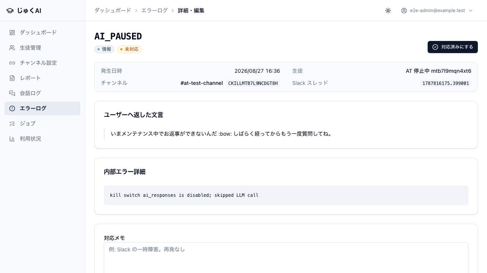
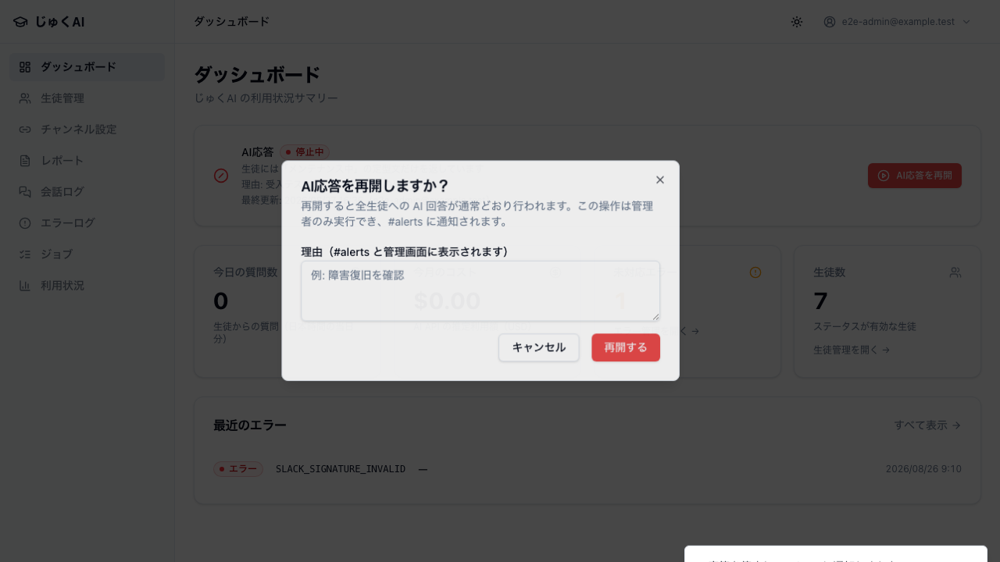
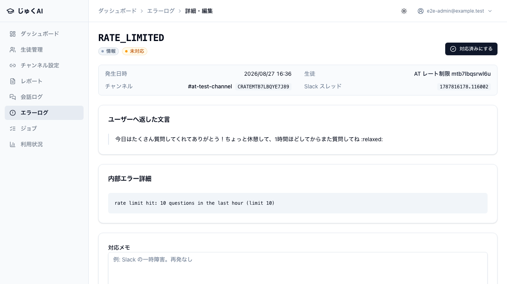

# 30. コスト制御・緊急停止

実施日: 2026-08-02 / commit `89dac7e` / 結果: **8 ケース PASS・FAIL 0**

---

## このカテゴリが守るもの

生成 AI は**放置すると課金が青天井に伸びる**。しかも伸びていることに気づくのが遅れる。
このカテゴリは 3 段構えの遮断機構を検証する。

| 段 | 仕組み | 発動条件 | 検証ケース |
|---|---|---|---|
| 1. 手動の全停止 | `kill_switches` テーブル（F-1 / DEC-15） | 管理者が `/admin` から停止 | AT-40, AT-41, AT-43, AT-B19, AT-B20 |
| 2. 生徒単位の自動制限 | `RATE_LIMIT_QUESTIONS_PER_HOUR = 10`（F-2） | 直近 1 時間で 10 問到達 | AT-44, AT-44b |
| 3. 過少表示の検知 | `MODEL_PRICING` 未登録モデルの警告 | `/admin/usage` を開いたとき | AT-B22 |

**共通の判定基準**: どのケースも「定型文が返る」だけでなく、
**モック LLM への呼び出しが 0 件であること**まで確認している。
文言だけ差し替えて裏で LLM を呼んでいたらコスト遮断にならないため。

なお `kill_switches` は**全生徒に効くグローバル状態**なので、
これらの spec はファイル間ロック（`e2e/fixtures/lock.ts` の `KILL_SWITCH_LOCK`）で
`e2e/kill-switch.spec.ts` および `slack-flow.spec.ts` と排他している。
排他しないと、停止テストと並走したフルフローが `AI_PAUSED` を受けて偽 FAIL になる。

---

## AT-40 kill_switch 停止中は LLM を呼ばずメンテナンス文言だけを返す

**優先度**: 必須 / **実施方法**: acceptance spec（`e2e/acceptance/kill-switch-rate-limit.spec.ts`）
**要件**: F-1

### 目的

コスト暴走時に**アプリ内から即座に AI を止められる**こと。
これが無いと、止める手段が「Vercel の環境変数を変えて再デプロイ」か「API キーの失効」しか無くなる。

### 前提

- 生徒 + active な紐付け
- `kill_switches` の `ai_responses` を `enabled=false`、理由「受け入れテスト: コスト遮断の確認」に直接更新
  （UI ではなく DB を直接触るのは、前提条件づくりと UI 操作の検証を分けるため。UI は AT-41 が担当）

### 手順

停止状態でメンション付きイベントを POST。

### 期待結果

| 確認点 | 期待 |
|---|---|
| ACK | HTTP 200（Slack に再送させない） |
| 生徒への返答 | 「いまメンテナンス中でお返事ができないんだ」を含む |
| **LLM 呼び出し** | **0 回** |
| エラーログ | `ai_error_logs` に `AI_PAUSED` |

### 実結果

PASS。LLM 呼び出し 0 件を確認。テスト終了時に `resetKillSwitch()` で必ず稼働中へ戻している。

### 証拠

`evidence/AT-40_kill_switch停止中はLLMを呼ばない.png`
（`/admin/errors/{id}` の `AI_PAUSED` 詳細）

> **スクリーンショットの「ユーザーへ返した文言」欄に注意（OBS-07 / 修正済み）**。
> 撮影時点では「返信なし（サイレント処理されたエラーです）」と表示されているが、
> **実際には定型文を返している**（返答の有無はモック Slack への `chat.postMessage` に対する
> アサーションで確認済み）。この表示は修正済みで、現在は実際の文言が表示される。
> 経緯は `91_既知の制約.md` OBS-07 に記載。

---

## AT-41 管理者は管理画面から停止・再開でき、状態が表示される

**優先度**: 必須 / **実施方法**: acceptance spec / **要件**: F-1 / DEC-15

### 目的

停止手段が**エンジニアでなくても使える**こと。障害時に SQL を書ける人を待つ運用は成立しない。
併せて「いま止まっているのか」がダッシュボードで一目で分かること。

### 手順

1. `/admin` を開く（初期状態: 稼働中）
2. 「AI応答を停止」→ 理由を入力 →「停止する」
3. 「AI応答を再開」→ 理由を入力 →「再開する」

### 期待結果

| # | 確認点 | 期待 |
|---|---|---|
| 1 | 初期表示 | 「稼働中」 |
| 2 | 停止後トースト | 「AI応答を停止しました」系 |
| 3 | 停止後カード | 「停止中」 |
| 4 | 理由表示 | 「理由: 受入テスト AT-41: 緊急停止の確認」 |
| 5 | 再開後 | 「稼働中」に戻る |

### 実結果

PASS。理由が画面に残ることも確認（「誰かが止めたが理由が分からない」を防ぐ）。

### 証拠

`evidence/AT-41_kill_switch_停止中の状態表示.png`

---

## AT-43 kill_switch の状態変化が #alerts に通知される

**優先度**: 必須 / **実施方法**: acceptance spec / **要件**: DEC-15

### 目的

停止は「誰かが操作したこと」がチームに伝わらないと危険。
特に**再開し忘れ**は全生徒が「メンテナンス中」の返答しか受け取れない状態を生む。

### 前提

`SLACK_ALERTS_CHANNEL_ID`（E2E 既定 `C0E2EALERTS`）。通知先はモック Slack。

### 手順

1. 通知前の `chat.postMessage`（宛先 = alerts チャンネル）の件数を記録
2. `/admin` から理由「受入テスト AT-43: 通知の確認」で停止
3. alerts チャンネル宛の投稿が 1 件増えるまで待つ

### 期待結果

追加された投稿の本文に、以下がすべて含まれる。

- 「AI応答を停止しました」
- 入力した理由「受入テスト AT-43: 通知の確認」
- **操作者のメールアドレス**（`@example.test` を含む）

### 実結果

PASS。3 点すべて確認。

### 保証すること / しないこと

- **保証する**: 通知メッセージの組み立て（イベント種別・理由・操作者）と、送信の発火。
- **保証しない**: 実 Slack の `#alerts` に**実際に着弾する**こと。
  投稿先はモックであり、実チャンネル ID の設定ミス・Bot 未招待・スコープ不足は検出できない
  → AT-P08。

---

## AT-44 直近 1 時間で 10 回に達した生徒には定型文を返し LLM を呼ばない

**優先度**: 必須 / **実施方法**: acceptance spec / **要件**: F-2

### 目的

1 人の生徒（あるいは 1 つの暴走したクライアント）が全体のコストを食い潰さないこと。
kill_switch が「全員を止める」のに対し、こちらは**その生徒だけを一時的に止める**。

### 前提

`ai_usage_logs` に、対象生徒・対象チャンネルで **10 件**の質問ログを種まき
（`message_ts` に `-eval` / `-summary` サフィックスを付けない。付くと質問数の集計から除外されるため）。

### 手順

11 回目に相当するメンション付きイベントを POST。

### 期待結果

| 確認点 | 期待 |
|---|---|
| ACK | HTTP 200 |
| 生徒への返答 | 「ちょっと休憩して、1時間ほどしてからまた質問してね」を含む |
| **LLM 呼び出し** | **0 回** |
| エラーログ | `ai_error_logs` に `RATE_LIMITED` |

### 実結果

PASS。

### 証拠

`evidence/AT-44_レート制限到達時はLLMを呼ばない.png`
（`/admin/errors/{id}` の `RATE_LIMITED` 詳細。生徒・チャンネル・内部詳細
`rate limit hit: 10 questions in the last hour (limit 10)` が特定できることも確認）

> AT-40 と同じく「ユーザーへ返した文言」欄が「返信なし」と表示される。
> **実際には「ちょっと休憩して…」の定型文を返している**（アサーション済み）。
> → `91_既知の制約.md` OBS-07

---

## AT-44b 上限未満（9 回）の生徒は通常どおり回答を受け取れる

**優先度**: 推奨 / **実施方法**: acceptance spec

### 目的

**境界の反対側**。AT-44 だけだと「常に制限されている」実装でも PASS してしまう。
オフバイワンで 1 問早く締め出す不具合は、生徒体験を静かに壊すため対で置いている。

### 前提

`ai_usage_logs` に **9 件**の質問ログを種まき。

### 手順

10 回目に相当するメンション付きイベントを POST。

### 期待結果

- 投稿本文が通常回答「モックLLMの回答です」
- LLM 呼び出しが **ちょうど 1 回**

### 実結果

PASS。9 件時点では通し、10 件到達で締める境界が正しいことを確認。

---

## 基礎 E2E で担保しているケース

| ID | 内容 | spec | Playwright テスト数 | 結果 |
|---|---|---|---|---|
| AT-B19 | 管理者: 停止 → 確認ダイアログ文言 → 理由入力 → 停止トースト → 理由表示 → 再開 の一連 | `e2e/kill-switch.spec.ts` | 1 | PASS |
| AT-B20 | staff の切替は拒否され、**状態は変わらない**。失敗時はダイアログを閉じない（やり直せるように）。リロード後も元の状態 | `e2e/kill-switch.spec.ts` | 1 | PASS |
| AT-B22 | 単価未登録モデルが使われていると `/admin/usage` に警告が出る。①原因モデル名を名指し ②`MODEL_PRICING` への追加を案内 ③「遡って再計算されない」ことを明記 | `e2e/usage-cost-warning.spec.ts` | 1 | PASS |

### AT-B22 の意義

`MODEL_PRICING` に無いモデルは `estimated_cost = 0` で記録される（トークン数は記録される）。
エラーにはならないため、**プロバイダを切り替えて単価登録を忘れると、コストが $0 のまま積み上がって暴走に気づけない**。
画面に「単価が未登録のモデル」警告と対処手順（`constants.ts` に追加 → 再デプロイ、既存ログは再計算されない）を出すことで、
この静かな失敗を検知可能にしている。

---

## このカテゴリの総括

| 観点 | 状態 |
|---|---|
| 全停止（手動） | UI から停止・再開でき、停止中は LLM を呼ばない（AT-40, AT-41, AT-B19） |
| 停止権限 | staff は切替できず状態も変わらない（AT-B20） |
| 停止の可視化 | ダッシュボードの状態表示 + 理由 + #alerts 通知（AT-41, AT-43） |
| 生徒単位の制限 | 10 問到達で遮断、9 問では通す（AT-44, AT-44b） |
| コスト過少表示の検知 | 単価未登録モデルの警告と対処手順（AT-B22） |
| 未検証（実機送り） | #alerts の実着弾・実 LLM での cost 記録・実運用でのレート制限体感 → `90_本番疎通チェックリスト.md` |
